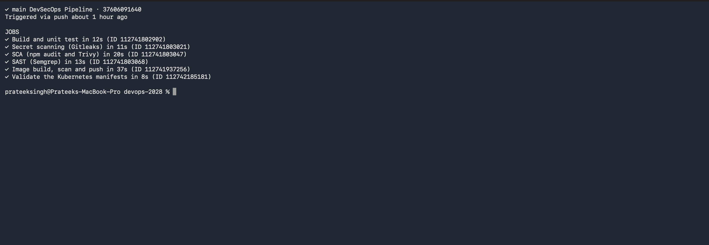
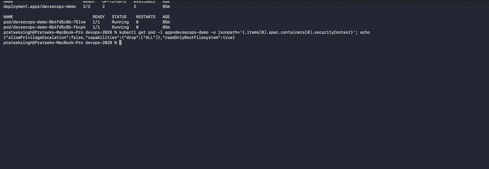

# Complete CI/CD and DevSecOps (Session 17)

**Name:** Prateek Singh
**Enrollment number:** 24BCS10135

## Homework task

Build a complete CI/CD plus DevSecOps pipeline covering build, unit testing, Docker image
build, container registry and Kubernetes deployment, with SAST, SCA, secret scanning,
container image scanning and security gates.

Workflow: [`.github/workflows/devsecops.yml`](../.github/workflows/devsecops.yml)

**This pipeline really runs, and the security gate really blocked a build.** That is the most
useful thing in this writeup, so it is documented in full below.

## The flow

```
Code
 ↓
Build ──────────────┐
 ↓                  │
Unit Test           │  these four run in parallel
 ↓                  │
SAST ───────────────┤
 ↓                  │
SCA ────────────────┤
 ↓                  │
Secret Scan ────────┘
 ↓
Docker Build  (built but NOT pushed yet)
 ↓
Container Image Scan
 ↓
Security Gate  ← nothing is published unless every scan passed
 ↓
Push Image to ghcr.io
 ↓
Kubernetes manifests
```

The four scanning jobs run at the same time because none depends on another, so the whole
set finishes in about 20 seconds rather than one after another.

---

## DevSecOps in one line

Security moves from a review at the end to checks inside the pipeline, so a problem is found
in the minute it is introduced instead of weeks later. The jargon for it is "shift left".

## The scan types

| Scan | Looks at | Tool I used |
|---|---|---|
| **SAST** | My own source code | Semgrep |
| **SCA** | The dependencies I pull in | npm audit and Trivy |
| **Secret scanning** | Credentials committed by accident | Gitleaks |
| **Image scanning** | The OS packages and libraries in the built image | Trivy |

They cover different things and none replaces another. SAST would never find a vulnerable
version of express, and SCA would never find my own SQL injection.

---

## The application

[app/](app) is a small Node.js app written with the scanners in mind:

```javascript
function sanitise(input) {
  if (typeof input !== "string") {
    return "";
  }
  // strip the characters that would let someone inject HTML
  return input.replace(/[<>&"']/g, "");
}
```

The `?name=` parameter is echoed back into the page, which is the classic cross site scripting
hole. Sanitising it is what stops that, and there is a test for it:

```javascript
test("sanitise strips characters used for HTML injection", () => {
  assert.strictEqual(sanitise("<script>alert(1)</script>"), "scriptalert(1)/script");
});
```

Secrets come from the environment, never from the source:

```javascript
const API_KEY = process.env.API_KEY || "not-set";
```

## The hardened Dockerfile

```dockerfile
FROM node:22-alpine AS build
WORKDIR /app
COPY app/package.json ./
RUN npm install --omit=dev
COPY app/ ./
RUN npm test

FROM node:22-alpine AS production
WORKDIR /app

# The scan also flagged an OpenSSL CVE in the base image, so pull in the
# patched Alpine packages before anything else.
RUN apk upgrade --no-cache

# a non root user, so a compromise inside the container is not root
RUN addgroup -S appuser && adduser -S appuser -G appuser

# The image scan flagged HIGH CVEs in packages bundled with npm itself
# (pacote, picomatch, sigstore). The running app only needs node, not npm,
# so removing npm takes those packages out of the image entirely.
RUN rm -rf /usr/local/lib/node_modules/npm \
           /usr/local/bin/npm \
           /usr/local/bin/npx

COPY --from=build /app/node_modules ./node_modules
COPY --from=build /app/package.json ./
COPY --from=build /app/app.js /app/server.js ./

USER appuser
EXPOSE 3000
HEALTHCHECK --interval=30s --timeout=3s \
  CMD wget -qO- http://localhost:3000/health || exit 1
CMD ["node", "server.js"]
```

Those two `RUN` lines were not there when I started. They were added **because the scanner
failed the build**, which is the whole story below.

---

# The security gate actually blocking a release

This is the part worth reading.

## The failing run

```text
$ gh run view 37605102760

X main DevSecOps Pipeline · 37605102760

JOBS
✓ Secret scanning (Gitleaks) in 7s
✓ SCA (npm audit and Trivy) in 23s
✓ Build and unit test in 11s
✓ SAST (Semgrep) in 13s
X Image build, scan and push in 29s
  ✓ Build the image (not pushed yet, it has to be scanned first)
  X Scan the image with Trivy
  - Security gate passed          <- never ran
  - Log in to the registry        <- never ran
  - Push the scanned image        <- never ran
```

Every one of my own checks passed. The image **built fine**. The scan is what stopped it:

```text
│ pacote (package.json)    │ CVE-2026-9496  │ 19.0.2 │ 21.5.1              │ pacote: Denial of Service via crafted spec.rawSpec
│ picomatch (package.json) │ CVE-2026-33671 │ 4.0.3  │ 4.0.4, 3.0.2, 2.3.2 │ picomatch: Regular Expression Denial of Service
│ sigstore (package.json)  │ CVE-2026-48815 │ 3.1.0  │ 4.1.1               │ sigstore: Unauthorized certificates accepted
##[error]Process completed with exit code 1.
```

**The three steps after it never ran.** The image was never pushed. That is the gate doing its
job, and I could not have demonstrated it better on purpose.

## Working out the root cause

The interesting part is that none of those three packages is in my `package.json`. I never
installed pacote, picomatch or sigstore.

They come bundled **inside npm**, which ships inside the `node:22-alpine` base image. So the
vulnerability was not in my code or even in my dependencies, it was in a tool that happened to
be sitting in my runtime image.

## The fix

My application runs with `node server.js`. It never calls npm. npm is only needed at **build**
time, and the build happens in a separate stage, so npm has no business being in the final
image at all.

```dockerfile
RUN rm -rf /usr/local/lib/node_modules/npm /usr/local/bin/npm /usr/local/bin/npx
```

Rescanning locally showed those three gone, and one more left:

```text
│ libcrypto3 │ CVE-2026-14456 │ HIGH │ fixed │ 3.5.7-r0 │ 3.5.8-r0 │ openssl: Denial of Service via unbounded memory growth
│ libssl3    │                │      │       │          │          │
```

An OpenSSL CVE in the Alpine base with a fix already published, so:

```dockerfile
RUN apk upgrade --no-cache
```

## Clean scan

```text
$ docker run --rm -v /var/run/docker.sock:/var/run/docker.sock aquasec/trivy \
    image --severity HIGH,CRITICAL --ignore-unfixed --exit-code 1 devsecops-demo:scan

Legend:
- '0': Clean (no security findings detected)

trivy exit code: 0
```

## The green run

```text
$ gh run view 37606091640

✓ main DevSecOps Pipeline · 37606091640

JOBS
✓ Build and unit test in 12s
✓ Secret scanning (Gitleaks) in 11s
✓ SCA (npm audit and Trivy) in 20s
✓ SAST (Semgrep) in 13s
✓ Image build, scan and push in 37s
✓ Validate the Kubernetes manifests in 8s
```



**The lesson:** the fix was not to lower the severity threshold or add an ignore rule, which
is the tempting shortcut. It was to take the vulnerable software out of the image, which made
the image smaller as well as safer.

---

## How each stage is configured

### SAST

```yaml
  sast:
    steps:
      - uses: semgrep/semgrep-action@v1
        with:
          config: p/javascript
```

Semgrep reads the source looking for dangerous patterns, like unsanitised input reaching a
response, or a hardcoded credential.

### SCA

```yaml
      - name: npm audit
        run: npm audit --audit-level=high
      - name: Trivy dependency scan
        uses: aquasecurity/trivy-action@v0.36.0
        with:
          scan-type: fs
          severity: HIGH,CRITICAL
          ignore-unfixed: true
          exit-code: '1'
```

`ignore-unfixed: true` is a deliberate choice. A CVE with no patch available cannot be acted
on, so failing the build for it just trains people to ignore the scanner.

### Secret scanning

```yaml
      - uses: actions/checkout@v4
        with:
          fetch-depth: 0        # the whole history, not just the latest commit
      - uses: gitleaks/gitleaks-action@v2
```

`fetch-depth: 0` matters. A secret committed and then removed is still in the history, and
still leaked. Scanning only the tip would miss it.

My [security/gitleaks.toml](security/gitleaks.toml) allowlists the placeholder values used in
this homework so they do not show as findings:

```toml
[allowlist]
regexes = [
  '''placeholder-not-a-real-key''',
  '''demo-key-12345''',
]
```

### Image scan and the gate

```yaml
      - name: Build the image (not pushed yet, it has to be scanned first)
        uses: docker/build-push-action@v6
        with:
          push: false
          load: true
      - name: Scan the image with Trivy
        with:
          exit-code: '1'
      - name: Security gate passed
        run: echo "All scans passed, the image is allowed to be published"
      - name: Push the scanned image
```

The order is the whole point: **build, scan, then push**. Pushing first and scanning after
would mean a vulnerable image is already in the registry where something could pull it.

The job level gate is this line:

```yaml
    needs: [build-and-test, sast, sca, secret-scan]
```

If any of those four fails, this job never starts.

---

## Kubernetes deployment

[kubernetes/deployment.yaml](kubernetes/deployment.yaml) with the security settings a scanner
and a policy checker look for:

```yaml
      securityContext:
        runAsNonRoot: true
        runAsUser: 1000
      containers:
        - name: app
          securityContext:
            allowPrivilegeEscalation: false
            readOnlyRootFilesystem: true
            capabilities:
              drop: ["ALL"]
```

Secrets come from a Secret, not the image:

```yaml
          env:
            - name: API_KEY
              valueFrom:
                secretKeyRef:
                  name: devsecops-secret
                  key: API_KEY
```

### Deployed and running

A GitHub runner cannot reach the kind cluster on my laptop, so the pipeline validates the
manifests and I ran the deployment locally:

```text
$ kubectl apply -f kubernetes/
deployment.apps/devsecops-demo created
service/devsecops-demo created
secret/devsecops-secret created
deployment "devsecops-demo" successfully rolled out

$ kubectl get deploy,pods -l app=devsecops-demo
NAME                             READY   UP-TO-DATE   AVAILABLE   AGE
deployment.apps/devsecops-demo   2/2     2            2           11s

NAME                                 READY   STATUS    RESTARTS   AGE
pod/devsecops-demo-8b4fd5c8b-75lvw   1/1     Running   0          11s
pod/devsecops-demo-8b4fd5c8b-f6cp4   1/1     Running   0          11s
```

The hardening really is applied to the running Pods:

```text
$ kubectl get pod -l app=devsecops-demo -o jsonpath='{.items[0].spec.securityContext}'
{"runAsNonRoot":true,"runAsUser":1000}

$ kubectl get pod -l app=devsecops-demo -o jsonpath='{.items[0].spec.containers[0].securityContext}'
{"allowPrivilegeEscalation":false,"capabilities":{"drop":["ALL"]},"readOnlyRootFilesystem":true}
```

The app works, the secret arrives from the Secret, and the sanitiser holds up against a real
request:

```text
$ kubectl exec dsctest -- wget -qO- http://devsecops-demo
<h1>Hello, guest</h1>

$ kubectl exec deploy/devsecops-demo -- printenv API_KEY
placeholder-not-a-real-key

$ kubectl exec dsctest -- wget -qO- 'http://devsecops-demo/?name=<script>bad</script>'
<h1>Hello, scriptbad/script</h1>
```

The last one is the XSS attempt being neutralised by the running application. The angle
brackets are gone, so the browser sees text instead of a script tag.



### Validation in the pipeline

`kubectl apply --dry-run=client` turned out to need a cluster for API discovery, which a
runner does not have, so the job failed. I switched to **kubeconform**, which validates
manifests against the schemas offline:

```yaml
      - name: Validate the manifests with kubeconform
        run: |
          curl -sSL -o kubeconform.tar.gz \
            https://github.com/yannh/kubeconform/releases/download/v0.6.7/kubeconform-linux-amd64.tar.gz
          tar xzf kubeconform.tar.gz kubeconform
          ./kubeconform -strict -summary cicd-devsecops/kubernetes/
```

---

## Problems I hit

| Problem | Cause | Fix |
|---|---|---|
| `Unable to resolve action aquasecurity/trivy-action@0.28.0` | That version tag does not exist | Checked the real releases, used `v0.36.0` |
| Image scan failed on pacote, picomatch, sigstore | They ship inside npm, which was in the runtime image | Removed npm from the final stage |
| Image scan then failed on OpenSSL | Base image packages were behind | `apk upgrade --no-cache` |
| Manifest validation failed on the runner | `kubectl --dry-run=client` still needs a cluster for API discovery | Used kubeconform instead |

## What I took away

- A security gate is only real if it can stop a release, and mine did. Three steps after the
  scan never ran.
- The vulnerabilities were not in my code or my dependencies. They were in a build tool
  sitting in my runtime image, which is a good argument for keeping final images minimal.
- Build, scan, then push. Pushing first means the vulnerable image already exists somewhere
  others can pull it.
- `ignore-unfixed` is worth setting, because failing on CVEs with no available patch just
  trains people to ignore the scanner.
- Secret scanning needs the full history, since a secret that was committed and then deleted
  has still leaked.
