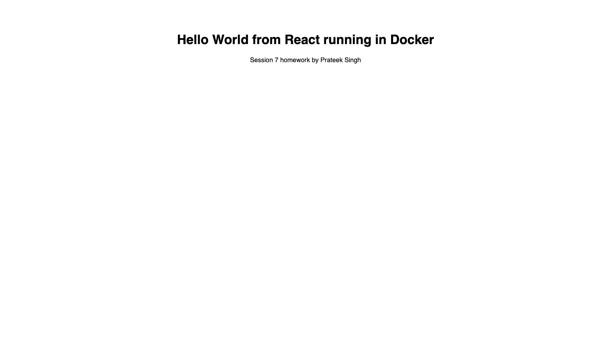
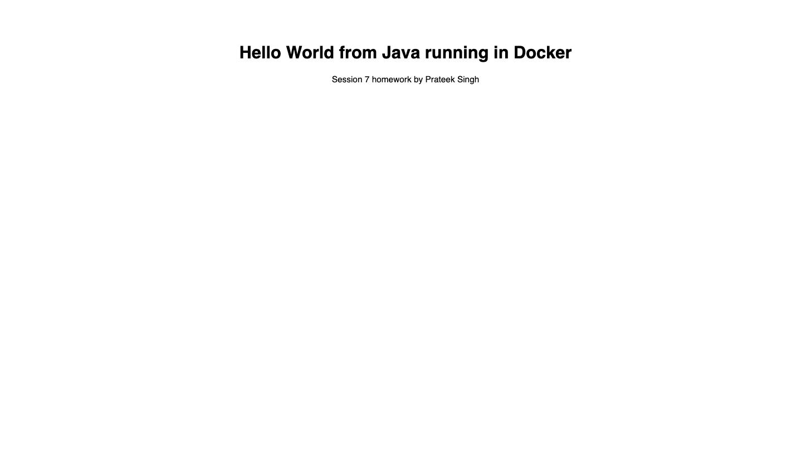
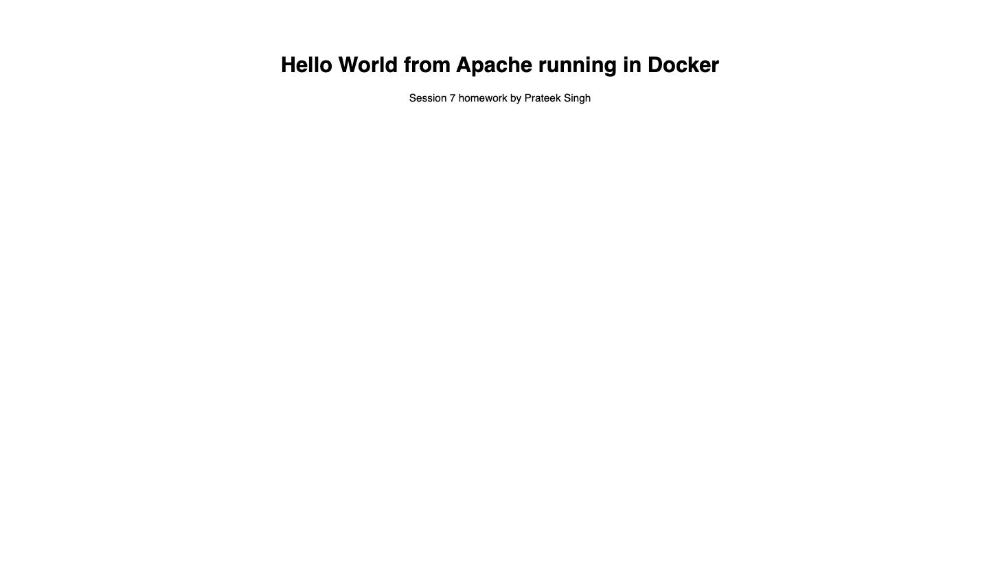
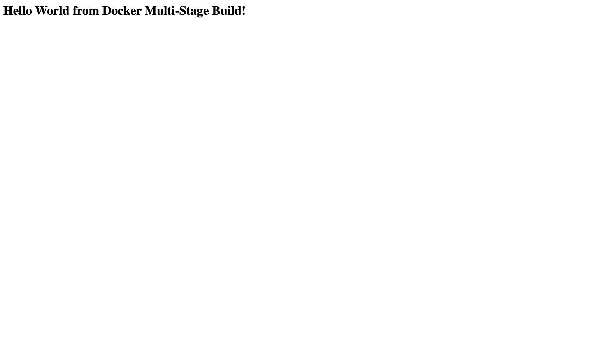

# Docker Images and Dockerfiles (Sessions 6 and 7)

**Name:** Prateek Singh
**Enrollment number:** 24BCS10135

## Homework

**Session 6:** make a simple Hello World web app for Node.js (preferably React), Python, Java
and Apache, each in its own folder with its own Dockerfile, and run them with Docker.

**Session 7:** clone the repo with the multi-stage Dockerfile from class, build the image, run
a container, access the app, and write an MD file with my name, enrollment number, the output
showing it running, and `docker ps` showing the container on port 8080.

## What is in this folder

| Folder | App | Port |
|---|---|---|
| [nodejs-app](nodejs-app) | React, served by nginx | 8081 |
| [python-app](python-app) | Flask | 8082 |
| [java-app](java-app) | Java web server | 8083 |
| [apache-app](apache-app) | Apache httpd | 8084 |
| [multi-stage-app](multi-stage-app) | Session 7 task | 8080 |

All five running at the same time:

```bash
$ docker ps
CONTAINER ID   IMAGE              COMMAND                  STATUS         PORTS                     NAMES
b40798e47ea8   multistage-hello   "docker-entrypoint.s…"   Up 5 minutes   0.0.0.0:8080->3000/tcp    multistage-app
d871ca3e6bd0   hello-apache       "httpd-foreground"       Up 7 minutes   0.0.0.0:8084->80/tcp      apache-web
e6f91aef3c22   hello-java         "/__cacert_entrypoin…"   Up 7 minutes   0.0.0.0:8083->8080/tcp    java-web
785ba03e42ef   hello-python       "python app.py"          Up 7 minutes   0.0.0.0:8082->5000/tcp    python-web
1015bdddd95f   hello-nodejs       "/docker-entrypoint.…"   Up 7 minutes   0.0.0.0:8081->80/tcp      react-app
```

---

# 1. React app

I used React because that was the preferred option. It is built with Vite.

`src/App.jsx`:

```jsx
function App() {
  return (
    <div style={{ fontFamily: 'sans-serif', textAlign: 'center', marginTop: '80px' }}>
      <h1>Hello World from React running in Docker</h1>
      <p>Session 7 homework by Prateek Singh</p>
    </div>
  )
}

export default App
```

## Dockerfile

A browser cannot run JSX directly, it has to be built into plain files first. Node is needed
to build it but not to serve it, so I used two stages.

```dockerfile
# Stage 1: build the React app
FROM node:22-alpine AS build

WORKDIR /app

COPY package.json ./
RUN npm install

COPY . .
RUN npm run build

# Stage 2: serve the built files with nginx
FROM nginx:alpine

COPY --from=build /app/dist /usr/share/nginx/html

EXPOSE 80

CMD ["nginx", "-g", "daemon off;"]
```

I copy `package.json` first and install before copying the code, so that changing my code does
not make `npm install` run again.

I also added a `.dockerignore` so my local `node_modules` is not sent into the build:

```
node_modules
dist
```

## Build and run

```bash
$ docker build -t hello-nodejs .
$ docker run -d --name react-app -p 8081:80 hello-nodejs

$ curl -i http://localhost:8081
HTTP/1.1 200 OK
Server: nginx/1.31.4
Content-Type: text/html
Content-Length: 328

<!DOCTYPE html>
<html lang="en">
  <head>
    <title>React Hello World</title>
    <script type="module" crossorigin src="/assets/index-DEnvGsv7.js"></script>
  </head>
  <body>
    <div id="root"></div>
  </body>
</html>
```

`curl` shows an empty page with only a script tag, because that is how React works. The HTML
is just a shell and React fills in the `root` div when the JavaScript runs, and `curl` does
not run JavaScript. The text is inside the built file:

```bash
$ docker exec react-app grep -o "Hello World from React running in Docker" /usr/share/nginx/html/assets/*.js
Hello World from React running in Docker
```

And node is not in the final image at all:

```bash
$ docker exec react-app sh -c 'which node'
node is not installed in the final image
```



---

# 2. Python app

The homework asks for a web app, so I used Flask instead of just printing Hello World.

`app.py`:

```python
from flask import Flask

app = Flask(__name__)


@app.route("/")
def hello():
    return """
    <html>
      <head><title>Python Hello World</title></head>
      <body style="font-family: sans-serif; text-align: center; margin-top: 80px;">
        <h1>Hello World from Python running in Docker</h1>
        <p>Session 7 homework by Prateek Singh</p>
      </body>
    </html>
    """


if __name__ == "__main__":
    app.run(host="0.0.0.0", port=5000)
```

`host="0.0.0.0"` is important. Flask uses `127.0.0.1` by default, which inside a container
means only that container, so the port mapping cannot reach it.

```dockerfile
FROM python:3.12-slim

WORKDIR /app

COPY requirements.txt .
RUN pip install --no-cache-dir -r requirements.txt

COPY app.py .

EXPOSE 5000

CMD ["python", "app.py"]
```

I used `python:3.12-slim` because it is much smaller than the full image, and I did not add
`apt install python3 pip3` because the image already has Python and pip.

```bash
$ docker build -t hello-python .
$ docker run -d --name python-web -p 8082:5000 hello-python

$ curl -i http://localhost:8082
HTTP/1.1 200 OK
Server: Werkzeug/3.1.8 Python/3.12.14
Content-Type: text/html; charset=utf-8

    <html>
      <head><title>Python Hello World</title></head>
      <body style="font-family: sans-serif; text-align: center; margin-top: 80px;">
        <h1>Hello World from Python running in Docker</h1>
        <p>Session 7 homework by Prateek Singh</p>
      </body>
    </html>
```

The mapping is `8082:5000`, so port 8082 on my laptop goes to 5000 in the container, because
that is the port Flask is listening on.


---

# 3. Java app

Java usually needs Maven and a lot of dependencies, but for a Hello World page the JDK already
has a web server built in, so this is one file and no build tool.

`Main.java`:

```java
import com.sun.net.httpserver.HttpServer;
import java.net.InetSocketAddress;
import java.io.OutputStream;

public class Main {
    public static void main(String[] args) throws Exception {
        HttpServer server = HttpServer.create(new InetSocketAddress(8080), 0);

        server.createContext("/", exchange -> {
            String html = "<h1>Hello World from Java running in Docker</h1>";
            byte[] body = html.getBytes();
            exchange.getResponseHeaders().set("Content-Type", "text/html");
            exchange.sendResponseHeaders(200, body.length);
            try (OutputStream out = exchange.getResponseBody()) {
                out.write(body);
            }
        });

        server.start();
        System.out.println("Java web server started on port 8080");
    }
}
```

## Dockerfile

Java is a good example for multi-stage. Compiling needs `javac` which is only in the JDK, but
running only needs `java` which is in the smaller JRE.

```dockerfile
# Stage 1: compile, needs the JDK because javac is in the JDK
FROM eclipse-temurin:21-jdk-alpine AS build

WORKDIR /app

COPY Main.java .
RUN javac Main.java

# Stage 2: run, only needs the JRE
FROM eclipse-temurin:21-jre-alpine

WORKDIR /app

COPY --from=build /app/Main.class .

EXPOSE 8080

CMD ["java", "Main"]
```

```bash
$ docker build -t hello-java .
$ docker run -d --name java-web -p 8083:8080 hello-java

$ curl -i http://localhost:8083
HTTP/1.1 200 OK
Content-type: text/html
Content-length: 252

<html>
  <head><title>Java Hello World</title></head>
  <body style="font-family: sans-serif; text-align: center; margin-top: 80px;">
    <h1>Hello World from Java running in Docker</h1>
    <p>Session 7 homework by Prateek Singh</p>
  </body>
</html>
```

The app uses 8080 inside the container but I mapped it to 8083, because 8080 was already used
by the session 7 app.



---

# 4. Apache

This is the shortest one because the official image is already a working web server, it just
needs my page.

```dockerfile
FROM httpd:2.4

COPY index.html /usr/local/apache2/htdocs/index.html

EXPOSE 80
```

The folder matters. Apache serves `/usr/local/apache2/htdocs` and nginx serves
`/usr/share/nginx/html`. I first used the nginx path by mistake and got the default
"It works!" page.

There is no `CMD` because the base image already has one, which shows in `docker ps` as
`httpd-foreground`.

```bash
$ docker build -t hello-apache .
$ docker run -d --name apache-web -p 8084:80 hello-apache

$ curl -i http://localhost:8084
HTTP/1.1 200 OK
Server: Apache/2.4.68 (Unix)
Content-Length: 319
Content-Type: text/html

<!DOCTYPE html>
<html lang="en">
  <head>
    <title>Apache Hello World</title>
  </head>
  <body style="font-family: sans-serif; text-align: center; margin-top: 80px;">
    <h1>Hello World from Apache running in Docker</h1>
    <p>Session 7 homework by Prateek Singh</p>
  </body>
</html>
```



---

# 5. Session 7: the multi-stage Dockerfile from class

**Name:** Prateek Singh
**Enrollment number:** 24BCS10135

## Clone the repo

```bash
$ git clone https://github.com/Nency-Ravaliya/devops-heros.git
Cloning into 'devops-heros'...
```

The Dockerfile is at `devops-heros/session6-docker/multi-stage-dockerfile/Dockerfile`:

```dockerfile
# Stage 1: Build
FROM node:24-alpine AS builder
WORKDIR /app
COPY package*.json ./
RUN npm install
COPY . .

# Stage 2: Production
FROM node:24-alpine AS production
WORKDIR /app
COPY --from=builder /app/package*.json ./
RUN npm install --omit=dev
COPY --from=builder /app/server.js ./
EXPOSE 3000
CMD ["npm", "start"]
```

Both stages use the same node image here. The difference is that stage 1 runs a normal
`npm install` which includes the dev dependencies, and stage 2 runs `npm install --omit=dev`
which only installs what is needed to run. So the dev dependencies are left behind.

## Build

```bash
$ cd devops-heros/session6-docker/multi-stage-dockerfile
$ docker build -t multistage-hello .
#12 [production 5/5] COPY --from=builder /app/server.js ./
#12 DONE 0.0s
#13 naming to docker.io/library/multistage-hello:latest done
```

## Run on port 8080

```bash
$ docker run -d --name multistage-app -p 8080:3000 multistage-hello
b40798e47ea8...
```

## docker ps showing the container on port 8080

```bash
$ docker ps --filter name=multistage-app
CONTAINER ID   IMAGE              COMMAND                  CREATED         STATUS         PORTS                                         NAMES
b40798e47ea8   multistage-hello   "docker-entrypoint.s…"   4 seconds ago   Up 4 seconds   0.0.0.0:8080->3000/tcp, [::]:8080->3000/tcp   multistage-app
```

## Accessing the app

```bash
$ curl -i http://localhost:8080
HTTP/1.1 200 OK
X-Powered-By: Express
Content-Type: text/html; charset=utf-8
Content-Length: 51

<h1>Hello World from Docker Multi-Stage Build!</h1>
```

```bash
$ docker logs multistage-app

> docker-hello-world@1.0.0 start
> node server.js

Server running on port 3000
```

The app says port 3000 and `docker ps` says `0.0.0.0:8080->3000/tcp`. Both are right, 3000 is
inside the container and 8080 is the port on my laptop.



The cloned repo is kept out of this repository with `.gitignore`, because a git repo inside
another git repo causes problems. The commands above are enough to do it again.

---

# How much multi-stage saves

I built the React and Java apps the normal single stage way too, to compare. Both extra
Dockerfiles are kept in the folders as `Dockerfile.single-stage`.

```bash
$ docker images | grep hello-
hello-nodejs-single    449MB
hello-java-single      555MB
hello-java             286MB
hello-python           223MB
hello-apache           205MB
hello-nodejs           92.9MB
```

| App | Single stage | Multi-stage |
|---|---|---|
| React | 449 MB | 92.9 MB |
| Java | 555 MB | 286 MB |

The React one saves the most because the whole node runtime and `node_modules` get left behind
and only static files are kept. The Java one still needs a JVM to run, so what it saves is the
compiler.

**The rule I understood:** anything needed only to build the app goes in an earlier stage, and
only the finished files and whatever runs them go in the last stage.

---

# Problems I had

| Problem | Reason | Fix |
|---|---|---|
| Flask container ran but curl said connection refused | Flask was on `127.0.0.1` | `app.run(host="0.0.0.0")` |
| Apache showed the default "It works!" page | I copied the file to the nginx folder | Apache uses `/usr/local/apache2/htdocs` |
| `-p 8080:80` said port already allocated | The session 7 app was using 8080 | Used 8081 to 8084 |
| React build was slow every time | I copied the code before `npm install` | Copy `package.json` first |
| Build context was very big | My `node_modules` was being uploaded | Added `.dockerignore` |

# Running everything

```bash
cd nodejs-app && docker build -t hello-nodejs . && docker run -d --name react-app -p 8081:80 hello-nodejs && cd ..
cd python-app && docker build -t hello-python . && docker run -d --name python-web -p 8082:5000 hello-python && cd ..
cd java-app && docker build -t hello-java . && docker run -d --name java-web -p 8083:8080 hello-java && cd ..
cd apache-app && docker build -t hello-apache . && docker run -d --name apache-web -p 8084:80 hello-apache && cd ..

docker rm -f react-app python-web java-web apache-web multistage-app
```
