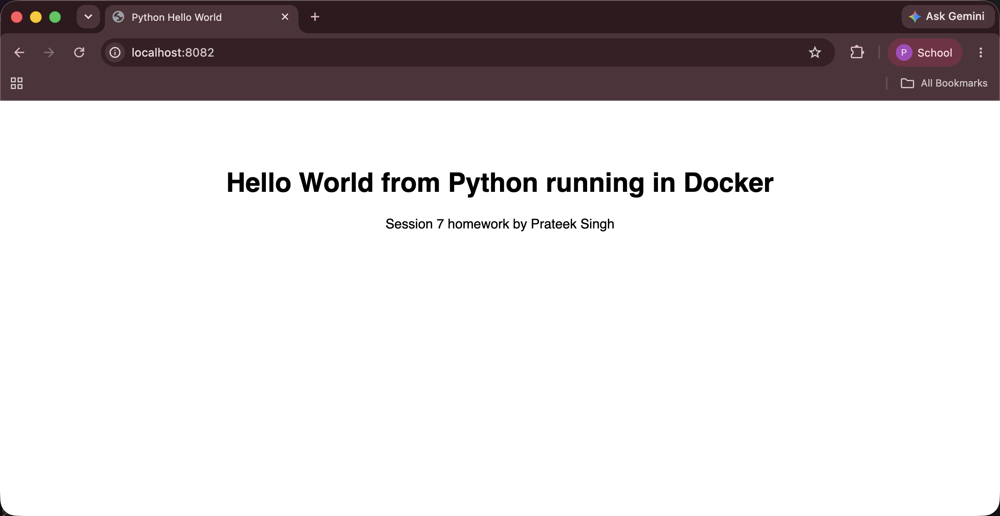
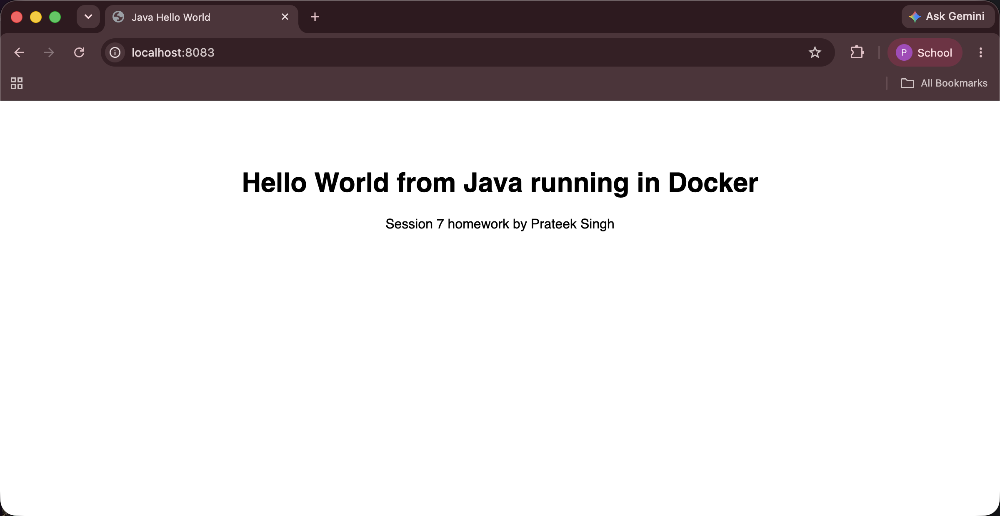
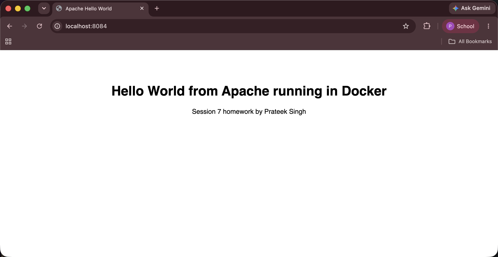
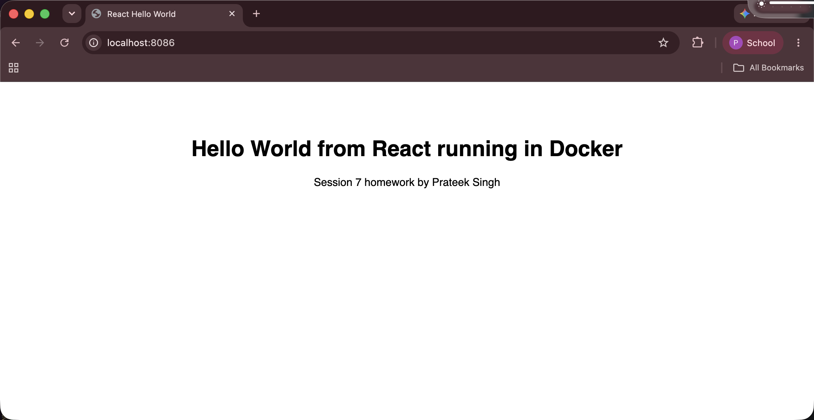
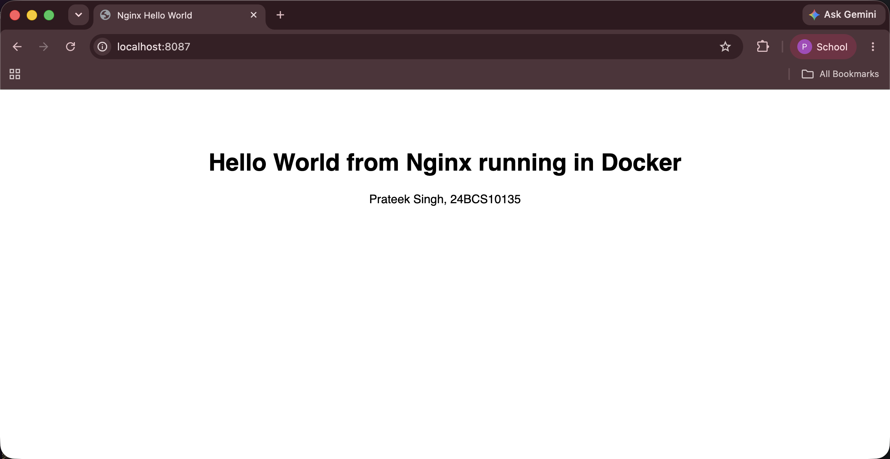

# Docker Homework Tasks

**Name:** Prateek Singh
**Enrollment number:** 24BCS10135

## Task: Hello World Applications

Create simple Hello World web applications using Docker for:

- Node.js application
- Python application
- Java application
- Apache web server
- React application
- Nginx application

## Requirements

For each application: a separate folder, the application code, a Dockerfile, build the
image, run it with Docker, and check that Hello World shows up on a webpage.

## Folder structure

```
docker-images/
├── nodejs-app/
├── python-app/
├── java-app/
├── Apache-app/
├── React-app/
├── nginx-app/
└── screenshots/
```

| Folder | Base image | Container port | Host port |
|---|---|---|---|
| [nodejs-app](nodejs-app) | `node:22-alpine` | 3000 | 8081 |
| [python-app](python-app) | `python:3.12-slim` | 5000 | 8082 |
| [java-app](java-app) | `eclipse-temurin:21-jdk-alpine` then `21-jre-alpine` | 8080 | 8083 |
| [Apache-app](Apache-app) | `httpd:2.4` | 80 | 8084 |
| [React-app](React-app) | `node:22-alpine` then `nginx:alpine` | 80 | 8086 |
| [nginx-app](nginx-app) | `nginx:alpine` | 80 | 8087 |

## All six running at the same time

```bash
$ docker ps --format 'table {{.Names}}\t{{.Image}}\t{{.Status}}\t{{.Ports}}'
NAMES            IMAGE              STATUS         PORTS
nginx-web        hello-nginx        Up 3 minutes   0.0.0.0:8087->80/tcp
react-web        hello-react        Up 3 minutes   0.0.0.0:8086->80/tcp
apache-web       hello-apache       Up 3 minutes   0.0.0.0:8084->80/tcp
java-web         hello-java         Up 3 minutes   0.0.0.0:8083->8080/tcp
python-web       hello-python       Up 3 minutes   0.0.0.0:8082->5000/tcp
nodejs-web       hello-nodejs       Up 3 minutes   0.0.0.0:8081->3000/tcp
multistage-app   multistage-hello   Up 3 days      0.0.0.0:8080->3000/tcp
```


The last one is the multi-stage app from the other homework, which is in
[../docker-multi-stage](../docker-multi-stage).

---

# 1. nodejs-app

A plain Node.js app using Express.

`server.js`:

```javascript
const express = require("express");

const app = express();
const PORT = 3000;

app.get("/", (req, res) => {
  res.send(`
    <html>
      <head><title>Node.js Hello World</title></head>
      <body style="font-family: sans-serif; text-align: center; margin-top: 80px;">
        <h1>Hello World from Node.js running in Docker</h1>
        <p>Prateek Singh, 24BCS10135</p>
      </body>
    </html>
  `);
});

// 0.0.0.0 so the app listens on all interfaces and the port mapping can reach it
app.listen(PORT, "0.0.0.0", () => {
  console.log(`Server running on port ${PORT}`);
});
```

`Dockerfile`:

```dockerfile
FROM node:22-alpine

WORKDIR /app

# package.json is copied first so the npm install layer stays cached
# when only my code changes
COPY package.json ./
RUN npm install

COPY server.js ./

EXPOSE 3000

CMD ["npm", "start"]
```

Build and run:

```bash
$ docker build -t hello-nodejs .
$ docker run -d --name nodejs-web -p 8081:3000 hello-nodejs
```


---

# 2. python-app

A Flask web app, so it serves a page instead of just printing to the terminal.

`app.py`:

```python
from flask import Flask

app = Flask(__name__)


@app.route("/")
def hello():
    return """
    <html>
      <head><title>Python Hello World</title></head>
      <body style="font-family: sans-serif; text-align: center; margin-top: 80px;">
        <h1>Hello World from Python running in Docker</h1>
        <p>Session 7 homework by Prateek Singh</p>
      </body>
    </html>
    """


if __name__ == "__main__":
    app.run(host="0.0.0.0", port=5000)
```

`host="0.0.0.0"` matters. Flask uses `127.0.0.1` by default, which inside a container means
only that container, so the port mapping cannot reach it.

`Dockerfile`:

```dockerfile
FROM python:3.12-slim

WORKDIR /app

COPY requirements.txt .
RUN pip install --no-cache-dir -r requirements.txt

COPY app.py .

EXPOSE 5000

CMD ["python", "app.py"]
```

```bash
$ docker build -t hello-python .
$ docker run -d --name python-web -p 8082:5000 hello-python
```



---

# 3. java-app

The JDK already has a web server built in, so this needs one source file and no build tool.

`Main.java` uses `com.sun.net.httpserver.HttpServer` and listens on port 8080.

`Dockerfile`:

```dockerfile
# Stage 1: compile, needs the JDK because javac is in the JDK
FROM eclipse-temurin:21-jdk-alpine AS build

WORKDIR /app

COPY Main.java .
RUN javac Main.java

# Stage 2: run, only needs the JRE
FROM eclipse-temurin:21-jre-alpine

WORKDIR /app

COPY --from=build /app/Main.class .

EXPOSE 8080

CMD ["java", "Main"]
```

Two stages because compiling needs `javac` from the JDK but running only needs `java` from
the smaller JRE. The `.java` source file never reaches the final image either.

```bash
$ docker build -t hello-java .
$ docker run -d --name java-web -p 8083:8080 hello-java
```



---

# 4. Apache-app

The shortest one, because the official image is already a working web server.

`Dockerfile`:

```dockerfile
FROM httpd:2.4

COPY index.html /usr/local/apache2/htdocs/index.html

EXPOSE 80
```

The folder matters. Apache serves `/usr/local/apache2/htdocs` and nginx serves
`/usr/share/nginx/html`. I first used the nginx path by mistake and got the default
"It works!" page.

```bash
$ docker build -t hello-apache .
$ docker run -d --name apache-web -p 8084:80 hello-apache
```



---

# 5. React-app

React built with Vite, then served by nginx.

`src/App.jsx`:

```jsx
function App() {
  return (
    <div style={{ fontFamily: 'sans-serif', textAlign: 'center', marginTop: '80px' }}>
      <h1>Hello World from React running in Docker</h1>
      <p>Session 7 homework by Prateek Singh</p>
    </div>
  )
}

export default App
```

`Dockerfile`:

```dockerfile
# Stage 1: build the React app
FROM node:22-alpine AS build

WORKDIR /app

COPY package.json ./
RUN npm install

COPY . .
RUN npm run build

# Stage 2: serve the built files with nginx
FROM nginx:alpine

COPY --from=build /app/dist /usr/share/nginx/html

EXPOSE 80

CMD ["nginx", "-g", "daemon off;"]
```

A browser cannot run JSX directly, it has to be built into plain files first. Node is needed
to build it but not to serve it, so this uses two stages and the final image is just nginx
plus static files.

I also added a `.dockerignore` with `node_modules` and `dist`, so my local `node_modules`
does not get sent into the build.

```bash
$ docker build -t hello-react .
$ docker run -d --name react-web -p 8086:80 hello-react
```



`curl` on this one only returns an empty `<div id="root">` and a script tag, because React
fills the page in when the JavaScript runs and `curl` does not run JavaScript. The browser
does, which is what the screenshot shows.

The final image has no node in it at all:

```bash
$ docker exec react-web sh -c 'which node'
node is not installed in the final image
```

---

# 6. nginx-app

`Dockerfile`:

```dockerfile
FROM nginx:alpine

# nginx serves whatever is in this folder, so I only replace the default page
COPY index.html /usr/share/nginx/html/index.html

EXPOSE 80

CMD ["nginx", "-g", "daemon off;"]
```

```bash
$ docker build -t hello-nginx .
$ docker run -d --name nginx-web -p 8087:80 hello-nginx
```



This one and React-app both end up as nginx serving static files. The difference is that
React-app has to build the files first, and here I wrote the HTML by hand.

---

# Image sizes

```bash
$ docker images | grep hello-
hello-nginx     92.7MB
hello-react     92.9MB
hello-apache    205MB
hello-python    223MB
hello-nodejs    246MB
hello-java      286MB
```

The two nginx based ones are the smallest because alpine is small and static files weigh
almost nothing. `hello-nodejs` is bigger than `hello-react` even though the app is simpler,
because it keeps node and `node_modules` at runtime while React-app leaves them behind in the
build stage.

# Running all six

```bash
cd nodejs-app  && docker build -t hello-nodejs . && docker run -d --name nodejs-web -p 8081:3000 hello-nodejs && cd ..
cd python-app  && docker build -t hello-python . && docker run -d --name python-web -p 8082:5000 hello-python && cd ..
cd java-app    && docker build -t hello-java .   && docker run -d --name java-web   -p 8083:8080 hello-java   && cd ..
cd Apache-app  && docker build -t hello-apache . && docker run -d --name apache-web -p 8084:80   hello-apache && cd ..
cd React-app   && docker build -t hello-react .  && docker run -d --name react-web  -p 8086:80   hello-react  && cd ..
cd nginx-app   && docker build -t hello-nginx .  && docker run -d --name nginx-web  -p 8087:80   hello-nginx  && cd ..

docker rm -f nodejs-web python-web java-web apache-web react-web nginx-web
```

# Problems I had

| Problem | Reason | Fix |
|---|---|---|
| Flask container ran but curl said connection refused | Flask was listening on `127.0.0.1` | `app.run(host="0.0.0.0")` |
| Apache showed the default "It works!" page | I copied the file to the nginx folder | Apache uses `/usr/local/apache2/htdocs` |
| `-p 8080:80` said port already allocated | The multi-stage app was using 8080 | Used 8081 to 8087 for these |
| The React build was slow every time | I copied the code before `npm install` | Copy `package.json` first |
| Build context was very big | My local `node_modules` was being uploaded | Added `.dockerignore` |
