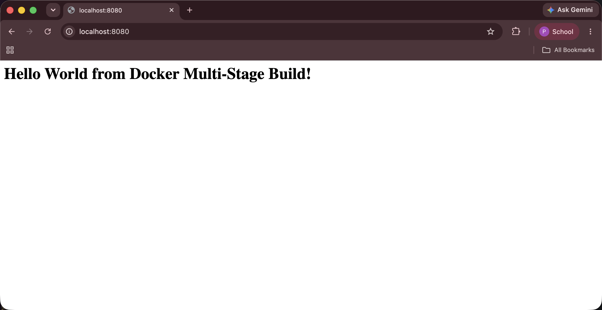
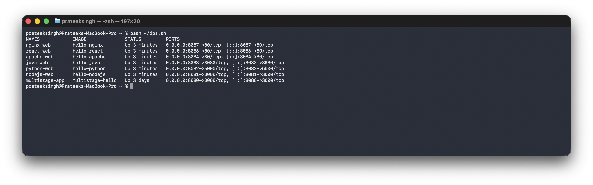

# Docker Multi-Stage Build Homework

**Name:** Prateek Singh
**Enrollment number:** 24BCS10135

## Homework tasks

**Task 1: Run Multi-Stage Dockerfile**
- Clone the repository containing the multi-stage Dockerfile.
- Build the Docker image using the multi-stage Dockerfile.
- Run a container from the image.
- Access the application running inside the container.
- Verify that the application displays "Hello World from Docker multi-stage build".
- Verify the running container using `docker ps`.
- Confirm that the application is running on port 8080.

**Task 2: Documentation**
- An `.md` file with my name, enrollment number, a screenshot or output showing the
  application running, and a screenshot or output of `docker ps` showing the container on
  port 8080.

**Task 3: Docker Application Deployment**
- Deploy at least 3 different types of applications using Docker, such as Node.js, Python
  and Java.

---

# Task 1: Run the multi-stage Dockerfile

## Clone the repository

```bash
$ git clone https://github.com/Nency-Ravaliya/devops-heros.git
Cloning into 'devops-heros'...
```

The Dockerfile is at `devops-heros/session6-docker/multi-stage-dockerfile/Dockerfile`:

```dockerfile
# -------------------------
# Stage 1: Build
# -------------------------
FROM node:24-alpine AS builder

WORKDIR /app

COPY package*.json ./

RUN npm install

COPY . .

# -------------------------
# Stage 2: Production
# -------------------------
FROM node:24-alpine AS production

WORKDIR /app

COPY --from=builder /app/package*.json ./

RUN npm install --omit=dev

COPY --from=builder /app/server.js ./

EXPOSE 3000

CMD ["npm", "start"]
```

Reading it before building: both stages use the same `node:24-alpine` image. The difference
is that stage 1 runs a normal `npm install` which includes the dev dependencies, and stage 2
runs `npm install --omit=dev` which only installs what is needed to run. So what gets left
behind here is the dev dependencies.

`COPY --from=builder` is the line that makes it multi-stage. It pulls files out of the first
stage into the second one, and anything not copied is thrown away.

## Build the image

```bash
$ cd devops-heros/session6-docker/multi-stage-dockerfile
$ docker build -t multistage-hello .
...
#12 [production 5/5] COPY --from=builder /app/server.js ./
#12 DONE 0.0s
#13 exporting to image
#13 naming to docker.io/library/multistage-hello:latest done
#13 DONE 0.2s
```

The step labels say `[builder 4/5]` and `[production 5/5]`, so Docker really is building two
separate images.

## Run a container on port 8080

```bash
$ docker run -d --name multistage-app -p 8080:3000 multistage-hello
b40798e47ea8...
```

## Access the application

```bash
$ curl -i http://localhost:8080
HTTP/1.1 200 OK
X-Powered-By: Express
Content-Type: text/html; charset=utf-8
Content-Length: 51

<h1>Hello World from Docker Multi-Stage Build!</h1>
```

In the browser:



That is the exact text the task asked for.

## Verify with docker ps on port 8080

```bash
$ docker ps --filter name=multistage-app
CONTAINER ID   IMAGE              COMMAND                  STATUS        PORTS                    NAMES
b40798e47ea8   multistage-hello   "docker-entrypoint.s…"   Up 3 days     0.0.0.0:8080->3000/tcp   multistage-app
```



`0.0.0.0:8080->3000/tcp` confirms it is on port 8080.

## Container logs

```bash
$ docker logs multistage-app

> docker-hello-world@1.0.0 start
> node server.js

Server running on port 3000
```

The app says port 3000 and `docker ps` says `0.0.0.0:8080->3000/tcp`. Both are correct, 3000
is the port inside the container and 8080 is the port on my laptop that leads to it.

## Image size

```bash
$ docker images multistage-hello
REPOSITORY         TAG      SIZE
multistage-hello   latest   243MB
```

---

# Task 2: Documentation

This file is the documentation. It has my name and enrollment number at the top, the output
and screenshot of the application running, and the output and screenshot of `docker ps`
showing the container on port 8080.

---

# Task 3: Three different types of applications

I deployed six, which covers the three asked for. They are in
[../docker-images](../docker-images) with a folder and Dockerfile each.

| Type | Folder | Port |
|---|---|---|
| Node.js | [../docker-images/nodejs-app](../docker-images/nodejs-app) | 8081 |
| Python | [../docker-images/python-app](../docker-images/python-app) | 8082 |
| Java | [../docker-images/java-app](../docker-images/java-app) | 8083 |
| Apache | [../docker-images/Apache-app](../docker-images/Apache-app) | 8084 |
| React | [../docker-images/React-app](../docker-images/React-app) | 8086 |
| Nginx | [../docker-images/nginx-app](../docker-images/nginx-app) | 8087 |

```bash
$ docker ps --format 'table {{.Names}}\t{{.Image}}\t{{.Status}}\t{{.Ports}}'
NAMES            IMAGE              STATUS         PORTS
nginx-web        hello-nginx        Up 3 minutes   0.0.0.0:8087->80/tcp
react-web        hello-react        Up 3 minutes   0.0.0.0:8086->80/tcp
apache-web       hello-apache       Up 3 minutes   0.0.0.0:8084->80/tcp
java-web         hello-java         Up 3 minutes   0.0.0.0:8083->8080/tcp
python-web       hello-python       Up 3 minutes   0.0.0.0:8082->5000/tcp
nodejs-web       hello-nodejs       Up 3 minutes   0.0.0.0:8081->3000/tcp
multistage-app   multistage-hello   Up 3 days      0.0.0.0:8080->3000/tcp
```

---

# What multi-stage builds actually save

I built two of my own apps both ways to measure it. The single stage Dockerfiles are kept as
`Dockerfile.single-stage` in the app folders.

```bash
$ docker images | grep -E 'hello-(react|java)'
hello-react           92.9MB
hello-java            286MB
hello-nodejs-single   449MB
hello-java-single     555MB
```

| App | Single stage | Multi-stage | Saved |
|---|---|---|---|
| React | 449 MB | 92.9 MB | about 79% smaller |
| Java | 555 MB | 286 MB | about 48% smaller |

React saves the most because the whole node runtime and `node_modules` are left behind and
only static files survive. Java still needs a JVM to run, so what it drops is the compiler
and the rest of the JDK.

Size is not the only benefit. The final React image has no node, no npm and no
`node_modules`, so problems in those packages cannot be used against it because they are not
in the image. The Java image has no compiler and not even the source file.

**The rule I took from this:** anything needed only to build the app belongs in an earlier
stage. Only the finished files and whatever runs them belong in the last stage.

## Note on the folder

The cloned class repo is kept out of this repository with `.gitignore`, because a git repo
inside another git repo causes problems. The commands above are enough to reproduce it.
