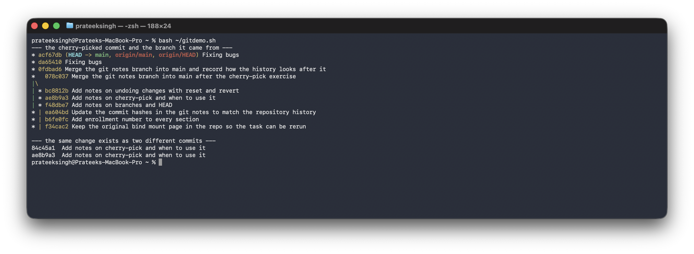

# Git and GitHub (Session 5)

**Name:** Prateek Singh
**Enrollment number:** 24BCS10135

## Homework tasks

**Task 1: `git commit -a -m`**
- Practice `git commit -a -m "message"`.
- Understand the difference between `git commit -a -m` and `git commit -m`.
- Test both commands and observe the difference.

**Task 2: Git Cherry-Pick**
- Create 2 to 4 commits in the main branch.
- Use `git log` to view the commits.
- Create a new branch.
- Make 2 to 3 commits in the new branch.
- Use `git log` to identify a specific commit.
- Cherry-pick one specific commit from the new branch into the main branch.
- Verify that the selected commit is now available in the main branch.

I did the exercise in this repository itself, so it is part of the real history and can be
checked with `git log --oneline --graph`.

The [notes](notes) folder has the git notes I wrote, and those are also the files the
exercise commits.

---

# Task 1: git commit -a -m

I thought `-a` meant add everything, so it would be the same as `git add .` then
`git commit -m`. That is wrong.

`-a` stages every **tracked** file that has been modified. A new file that git has never seen
is untracked, so `-a` skips it.

## With a new file

```bash
$ git status --short
?? git-and-github/

$ git commit -a -m "Add git basics notes"
On branch main
Untracked files:
	git-and-github/

nothing added to commit but untracked files present (use "git add" to track)
```

Nothing was committed. The `??` means untracked.

## After adding it once

```bash
$ git add git-and-github/notes/git-basics.md
$ git commit -m "Add notes on the three areas git keeps"
```

Then I edited the same file and tried again:

```bash
$ git status --short
 M git-and-github/notes/git-basics.md

$ git commit -a -m "Expand the git basics notes with the diff commands"
[main 005952d] Expand the git basics notes with the diff commands
 1 file changed, 5 insertions(+)
```

This time it worked without `git add`. ` M` means modified but not staged.

## Difference

| | `git commit -m` | `git commit -a -m` |
|---|---|---|
| Staged changes | Yes | Yes |
| Modified tracked files not staged | No | Yes |
| New untracked files | No | **No** |
| Needs `git add` first | Yes | Only the first time |

So `-a` is a shortcut for tracked files only. I do not use it much because a new file gets
left out silently, and it puts all my changes in one commit instead of letting me choose what
goes together.

---

# Task 2: Git Cherry-Pick

## Step 1: commits on main

```bash
$ git log --oneline -6
005952d Expand the git basics notes with the diff commands
bcfa668 Add notes on the three areas git keeps
9e151e1 Add session 8 Docker networking, bind mount and volume tasks
bd1a8d0 Add Docker image notes with screenshots and the multi-stage task
85cdc96 Add Hello World apps and Dockerfiles for node, python, java and apache
c6c79f9 Add session 6 Docker fundamentals notes
```

In full there is more for each commit:

```bash
$ git log -1
commit 005952db98fe8218c2bbe68a34e1481b6be82c63
Author: Prateek Singh <apdprateeksingh@gmail.com>
Date:   Mon Aug 31 17:31:31 2026 +0530

    Expand the git basics notes with the diff commands
```

The hash is made from the files, the message, the author, the date and also the parent
commit. That last part is why a cherry-picked commit cannot keep the same hash.

## Step 2: new branch

```bash
$ git switch -c feature/git-notes
Switched to a new branch 'feature/git-notes'

$ git branch -v
* feature/git-notes 005952d Expand the git basics notes with the diff commands
  main              005952d Expand the git basics notes with the diff commands
```

Both branches point at the same commit, because a branch is just a pointer, not a copy of the
files.

## Step 3: three commits on the branch

I made three separate commits, one file each, so they can be picked separately.

```bash
$ git add git-and-github/notes/branching.md
$ git commit -m "Add notes on branches and HEAD"

$ git add git-and-github/notes/cherry-pick.md
$ git commit -m "Add notes on cherry-pick and when to use it"

$ git add git-and-github/notes/undoing-changes.md
$ git commit -m "Add notes on undoing changes with reset and revert"
```

```bash
$ git log --oneline -4
bc8812b Add notes on undoing changes with reset and revert
ae8b9a3 Add notes on cherry-pick and when to use it
f48dbe7 Add notes on branches and HEAD
005952d Expand the git basics notes with the diff commands
```

The one I want on main is the middle one, **ae8b9a3**.

## Step 4: back to main

```bash
$ git switch main
Switched to branch 'main'

$ ls git-and-github/notes/
git-basics.md
```

The three new files are not there, because switching branches changes the files to match that
branch.

## Step 5: cherry-pick

```bash
$ git cherry-pick ae8b9a3
[main 84c45a1] Add notes on cherry-pick and when to use it
 Date: Mon Aug 31 17:32:10 2026 +0530
 1 file changed, 55 insertions(+)
 create mode 100644 git-and-github/notes/cherry-pick.md

$ ls git-and-github/notes/
cherry-pick.md
git-basics.md
```

Only that one file came over. The other two are still only on the branch.

## Step 6: the history

```bash
$ git log --oneline --graph --all -8
* 84c45a1 Add notes on cherry-pick and when to use it
| * bc8812b Add notes on undoing changes with reset and revert
| * ae8b9a3 Add notes on cherry-pick and when to use it
| * f48dbe7 Add notes on branches and HEAD
|/
* 005952d Expand the git basics notes with the diff commands
* bcfa668 Add notes on the three areas git keeps
* 9e151e1 Add session 8 Docker networking, bind mount and volume tasks
* bd1a8d0 Add Docker image notes with screenshots and the multi-stage task
```

The `|/` is where the two branches split. The left line is main with one new commit and the
indented line is the branch with three.

## Step 7: the same change is now two commits

```bash
$ git log --format='%h  %s' feature/git-notes -3
bc8812b  Add notes on undoing changes with reset and revert
ae8b9a3  Add notes on cherry-pick and when to use it
f48dbe7  Add notes on branches and HEAD

$ git log --format='%h  %s' main -3
84c45a1  Add notes on cherry-pick and when to use it
005952d  Expand the git basics notes with the diff commands
bcfa668  Add notes on the three areas git keeps
```

Same message but a different hash. `ae8b9a3` on the branch and `84c45a1` on main.

Both have the same change:

```bash
$ git show --stat --oneline ae8b9a3
ae8b9a3 Add notes on cherry-pick and when to use it
 git-and-github/notes/cherry-pick.md | 55 +++++++++++++
 1 file changed, 55 insertions(+)

$ git show --stat --oneline 84c45a1
84c45a1 Add notes on cherry-pick and when to use it
 git-and-github/notes/cherry-pick.md | 55 +++++++++++++
 1 file changed, 55 insertions(+)
```

And the files are exactly the same:

```bash
$ git diff feature/git-notes:git-and-github/notes/cherry-pick.md main:git-and-github/notes/cherry-pick.md
(no output, so they are identical)
```

**So cherry-pick copies the change, not the commit.** It makes a new commit on the current
branch with the same change, and the hash is different because the parent commit is different.

## Verifying the commit is now in main



Both commits are visible in this one view. `ae8b9a3` is the original on the branch line and
`84c45a1` is the cherry-picked copy on the main line, so the change really is in main.

## Step 8: merging the branch after

Once the exercise was done I merged the branch into main so all the notes are in one place,
then deleted the branch.

```bash
$ git merge --no-ff feature/git-notes -m "Merge the git notes branch into main after the cherry-pick exercise"
Merge made by the 'ort' strategy.
 git-and-github/notes/branching.md       | 30 ++++++++++
 git-and-github/notes/undoing-changes.md | 40 ++++++++++++++
 2 files changed, 70 insertions(+)

$ git branch -d feature/git-notes
Deleted branch feature/git-notes
```

Only two files came over, because `cherry-pick.md` was already on main from the cherry-pick
and the content was the same, so there was nothing to merge for that file.

I used `--no-ff` so a merge commit is created. That keeps the shape of the history visible
even after the branch is deleted:

```bash
$ git log --oneline --graph -10
*   078c037 Merge the git notes branch into main after the cherry-pick exercise
|\
| * bc8812b Add notes on undoing changes with reset and revert
| * ae8b9a3 Add notes on cherry-pick and when to use it
| * f48dbe7 Add notes on branches and HEAD
* | ea604bd Update the commit hashes in the git notes to match the repository history
* | b6fe0fc Add enrollment number to every section
* | f34cac2 Keep the original bind mount page in the repo so the task can be rerun
* | f8e24b4 Add the systemd Dockerfile used for the journalctl task
* | ac8f37c Add session 5 git notes, the cherry-pick writeup and the main README
* | 84c45a1 Add notes on cherry-pick and when to use it
|/
```

Both copies of the change are visible here, `ae8b9a3` on the branch line and `84c45a1` on the
main line. Deleting the branch only removed the pointer, the commits are still there through
the merge commit.

## When to use cherry-pick

When a bug fix is on a branch that is not finished and the fix is needed on main now.
Merging the branch would bring the unfinished work too, so cherry-picking just the fix is
better. For normal work merging the whole branch is the right thing.

---

# Commands from the session

## Starting

```bash
git init
git clone <url>
git config user.name "Name"
git config user.email "email"
```

## Everyday

```bash
git status
git add file
git add .
git commit -m "message"
git commit -a -m "message"
git diff
git log --oneline
```

## GitHub

```bash
git remote add origin <url>
git remote -v
git push -u origin main
git push
git pull
```

## Branches

```bash
git branch
git switch -c name
git switch main
git merge name
git cherry-pick <hash>
git branch -d name
```

## Fixing mistakes

```bash
git restore file             # undo my edits to a file
git restore --staged file    # unstage but keep the changes
git commit --amend -m "msg"  # change the last commit message
git reset --hard HEAD~1      # delete the last commit and its changes
git revert <hash>            # new commit that undoes an old one
```

`reset` removes history and `revert` adds a new commit. On anything already pushed, use
`revert`.

## Cheat sheets from class

- https://git-scm.com/cheat-sheet
- https://education.github.com/git-cheat-sheet-education.pdf
