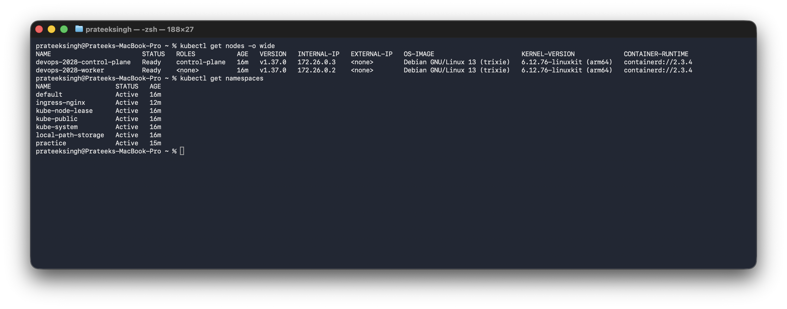
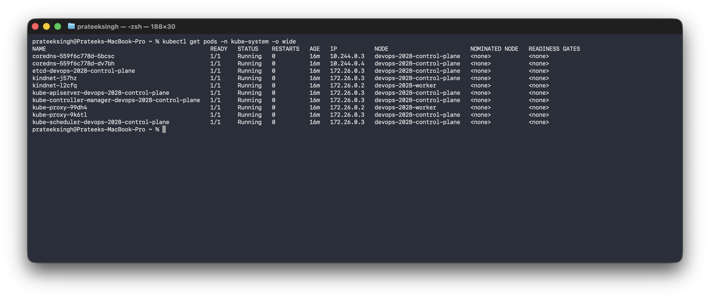
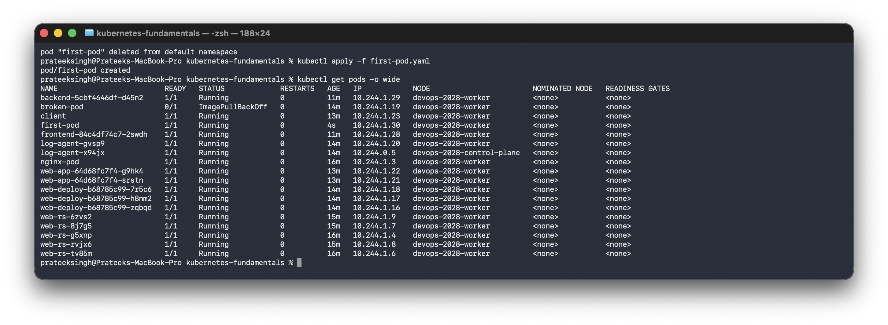
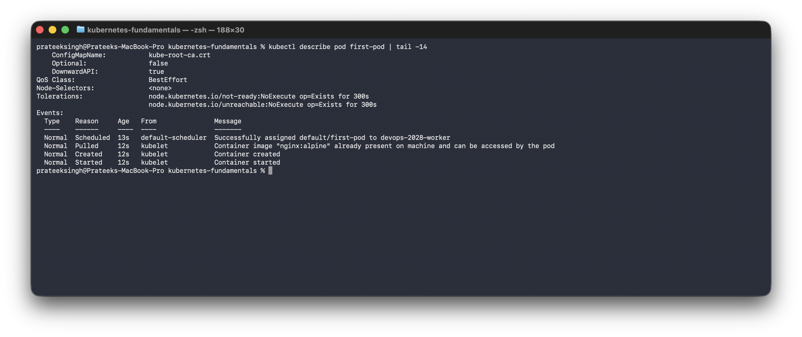

# Kubernetes Fundamentals

**Name:** Prateek Singh
**Enrollment number:** 24BCS10135

## Homework tasks

- Understand the Kubernetes architecture and what each component does.
- Set up a local cluster.
- Look at the cluster with `kubectl` and understand the output.
- Understand namespaces.
- Create a first Pod.

## My setup

I do not have a cloud cluster, so I made a local one with **kind**, which runs each
Kubernetes node as a Docker container. My cluster has one control plane node and one worker
node.

```bash
brew install kind
kind create cluster --config kind-cluster.yaml
```

The config file is [kind-cluster.yaml](kind-cluster.yaml). The extra port mapping in it is
for the ingress homework later on.

```text
$ kind create cluster --config kind-cluster.yaml
 ✓ Ensuring node image (kindest/node:v1.37.0)
 ✓ Preparing nodes
 ✓ Writing configuration
 ✓ Starting control-plane
 ✓ Installing CNI
 ✓ Installing StorageClass
 ✓ Joining worker nodes
Set kubectl context to "kind-devops-2028"
```

---

## 1. What Kubernetes is

Docker runs containers on one machine. If that machine goes down, or the container crashes,
or I need ten copies of the app, I have to do all of that by hand.

Kubernetes runs containers across a group of machines and keeps them running. I do not tell
it "start this container". I write down what I want, like "I want 3 copies of this app", and
Kubernetes keeps checking the real state against what I asked for and fixes the difference.
That is what **declarative** means, and it is the main idea behind everything else.

## 2. The architecture

The cluster is split into the **control plane**, which makes the decisions, and the
**worker nodes**, which run the actual application containers.

| Component | Runs on | What it does |
|---|---|---|
| `kube-apiserver` | Control plane | The front door. `kubectl` and everything else talks to it |
| `etcd` | Control plane | The database that stores the whole cluster state |
| `kube-scheduler` | Control plane | Decides which node a new Pod should run on |
| `kube-controller-manager` | Control plane | The loops that keep the real state matching what I asked for |
| `kubelet` | Every node | The agent that actually starts and watches the containers |
| `kube-proxy` | Every node | Sets up the network rules that make Services work |
| `containerd` | Every node | The container runtime that runs the containers |
| CoreDNS | Add-on | DNS inside the cluster, so Pods can find Services by name |

## 3. Cluster information

```text
$ kubectl version
Client Version: v1.34.1
Kustomize Version: v5.7.1
Server Version: v1.37.0

$ kubectl cluster-info
Kubernetes control plane is running at https://127.0.0.1:58031
CoreDNS is running at https://127.0.0.1:58031/api/v1/namespaces/kube-system/services/kube-dns:dns/proxy

$ kubectl get nodes -o wide
NAME                        STATUS   ROLES           AGE   VERSION   INTERNAL-IP   OS-IMAGE                       CONTAINER-RUNTIME
devops-2028-control-plane   Ready    control-plane   29s   v1.37.0   172.26.0.3    Debian GNU/Linux 13 (trixie)   containerd://2.3.4
devops-2028-worker          Ready    <none>          20s   v1.37.0   172.26.0.2    Debian GNU/Linux 13 (trixie)   containerd://2.3.4
```

Both nodes say `Ready`. One has the role `control-plane` and the other has no role, which
means it is a worker. The container runtime is containerd and not Docker, which surprised me
at first. Kubernetes stopped using Docker directly a few versions ago and talks to containerd
instead.



The namespace list in the screenshot has `ingress-nginx` in it as well, because I took it
after doing the ingress homework later on.

The first time I ran `kubectl get nodes` both nodes said `NotReady`, because the network
plugin was still starting. After about 20 seconds they turned `Ready`.

## 4. The architecture components are real Pods

The components in the table above are not magic, they run as Pods inside the cluster:

```text
$ kubectl get pods -n kube-system -o wide
NAME                                                READY   STATUS    RESTARTS   AGE   IP           NODE
coredns-559f6c778d-5bcsc                            1/1     Running   0          21s   10.244.0.3   devops-2028-control-plane
coredns-559f6c778d-dv7bh                            1/1     Running   0          21s   10.244.0.4   devops-2028-control-plane
etcd-devops-2028-control-plane                      1/1     Running   0          27s   172.26.0.3   devops-2028-control-plane
kindnet-j57hz                                       1/1     Running   0          21s   172.26.0.3   devops-2028-control-plane
kindnet-l2cfq                                       1/1     Running   0          20s   172.26.0.2   devops-2028-worker
kube-apiserver-devops-2028-control-plane            1/1     Running   0          27s   172.26.0.3   devops-2028-control-plane
kube-controller-manager-devops-2028-control-plane   1/1     Running   0          27s   172.26.0.3   devops-2028-control-plane
kube-proxy-99dh4                                    1/1     Running   0          20s   172.26.0.2   devops-2028-worker
kube-proxy-9k6tl                                    1/1     Running   0          21s   172.26.0.3   devops-2028-control-plane
kube-scheduler-devops-2028-control-plane            1/1     Running   0          27s   172.26.0.3   devops-2028-control-plane
```



Things I noticed reading this:

- `etcd`, `kube-apiserver`, `kube-scheduler` and `kube-controller-manager` are only on the
  control plane node, which matches the table.
- `kube-proxy` and `kindnet` have one copy on **each** node, because every node needs them.
- The control plane pods have the node IP `172.26.0.3` instead of a pod IP, because they run
  directly on the host network of the node.

## 5. Namespaces

A namespace is a way to split one cluster into separate areas so that names do not clash and
things stay organised.

```text
$ kubectl get namespaces
NAME                 STATUS   AGE
default              Active   29s
kube-node-lease      Active   29s
kube-public          Active   29s
kube-system          Active   29s
local-path-storage   Active   26s
```

| Namespace | What it is for |
|---|---|
| `default` | Where my own objects go if I do not say otherwise |
| `kube-system` | The cluster's own components |
| `kube-public` | Readable by everyone, mostly unused |
| `kube-node-lease` | Node heartbeats, so the cluster knows a node is alive |
| `local-path-storage` | Added by kind for storage |

Making my own:

```text
$ kubectl create namespace practice
namespace/practice created

$ kubectl get namespaces
NAME                 STATUS   AGE
default              Active   54s
kube-node-lease      Active   54s
kube-public          Active   54s
kube-system          Active   54s
local-path-storage   Active   51s
practice             Active   0s
```

`kubectl get pods` only looks in `default`. To look somewhere else I need `-n namespace`, and
`-A` looks in all of them. That is why `kubectl get pods` showed nothing at the start even
though the cluster had ten pods running in `kube-system`.

## 6. My first Pod

A **Pod** is the smallest thing Kubernetes runs. It is one or more containers that share a
network and storage. Most of the time it is just one container.

[first-pod.yaml](first-pod.yaml):

```yaml
apiVersion: v1
kind: Pod
metadata:
  name: first-pod
  labels:
    app: first-pod
spec:
  containers:
    - name: nginx
      image: nginx:alpine
      ports:
        - containerPort: 80
```

Every manifest has the same four top level keys:

- `apiVersion` which API version this object belongs to
- `kind` what kind of object it is
- `metadata` the name and labels
- `spec` what I actually want

```text
$ kubectl apply -f first-pod.yaml
pod/first-pod created

$ kubectl get pods -o wide
NAME        READY   STATUS    RESTARTS   AGE   IP           NODE
first-pod   1/1     Running   0          12s   10.244.1.2   devops-2028-worker
```

`READY 1/1` means one container out of one is ready. The Pod got the IP `10.244.1.2`, which
is from the pod network and not the node network, and the scheduler put it on the worker
node.



Looking closer with `describe`:

```text
$ kubectl describe pod first-pod
Name:             first-pod
Namespace:        default
Node:             devops-2028-worker/172.26.0.2
Labels:           app=first-pod
Status:           Running
IP:               10.244.1.2

Events:
  Type    Reason     Age   From               Message
  ----    ------     ----  ----               -------
  Normal  Scheduled  12s   default-scheduler  Successfully assigned default/first-pod to devops-2028-worker
  Normal  Pulling    11s   kubelet            Pulling image "nginx:alpine"
  Normal  Pulled     0s    kubelet            Successfully pulled image "nginx:alpine" in 11.673s
  Normal  Created    0s    kubelet            Container created
  Normal  Started    0s    kubelet            Container started
```



In the screenshot the `Pulled` line says the image was already on the machine, because by
then I had run this a second time and the image was cached. The first time it said it pulled
the image and how long that took.

The Events at the bottom are the useful part, and they show the architecture working in
order: the **scheduler** picked the node, then the **kubelet** on that node pulled the image
and started the container. This is the first place to look when a Pod will not start.

Logs of the container:

```text
$ kubectl logs first-pod
2026/09/17 18:10:09 [notice] 1#1: start worker process 46
2026/09/17 18:10:09 [notice] 1#1: start worker process 47
2026/09/17 18:10:09 [notice] 1#1: start worker process 48
```

## 7. Commands I used

| Command | What it does |
|---|---|
| `kubectl version` | Client and server versions |
| `kubectl cluster-info` | Where the control plane is |
| `kubectl get nodes` | The machines in the cluster |
| `kubectl get pods` | Pods in the current namespace |
| `kubectl get pods -A` | Pods in every namespace |
| `kubectl get pods -o wide` | Adds the IP and the node |
| `kubectl get namespaces` | List namespaces |
| `kubectl create namespace name` | Make one |
| `kubectl apply -f file.yaml` | Create or update from a file |
| `kubectl describe pod name` | Full details and the events |
| `kubectl logs name` | Container logs |
| `kubectl exec -it name -- sh` | Shell inside the container |
| `kubectl delete -f file.yaml` | Delete what the file created |

`kubectl apply` is the one to use rather than `kubectl create`, because `apply` works whether
the object exists yet or not, which fits the declarative idea.

## What I understood

- Kubernetes is declarative. I describe what I want and the controllers keep fixing the
  difference, instead of me running commands to change things.
- The control plane decides and the workers run. Both are made of ordinary Pods I can look at
  with `kubectl get pods -n kube-system`.
- Everything is an object described by `apiVersion`, `kind`, `metadata` and `spec`.
- The Events section of `kubectl describe` is where the answer is when something is wrong.

The rest of the Kubernetes homework:

- [kubernetes-pods-replicasets-deployments](../kubernetes-pods-replicasets-deployments)
- [kubernetes-networking-services](../kubernetes-networking-services)
- [kubernetes-ingress-configmaps-secrets](../kubernetes-ingress-configmaps-secrets)
