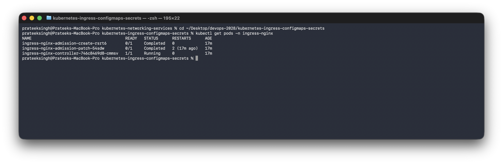
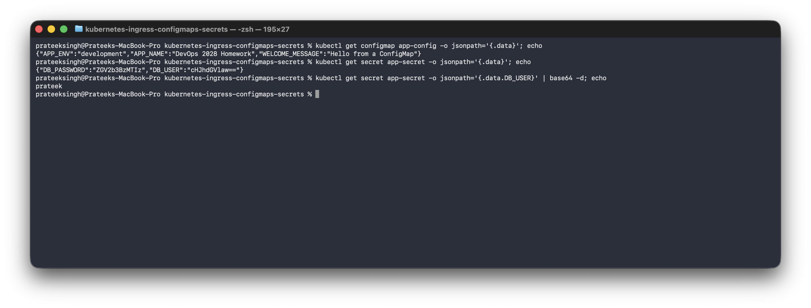
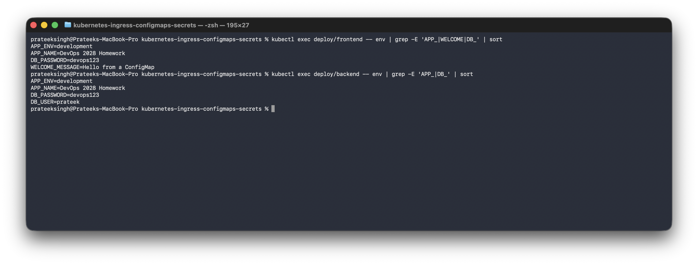
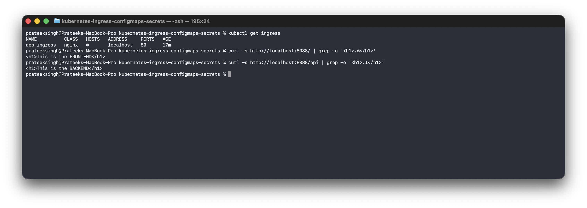
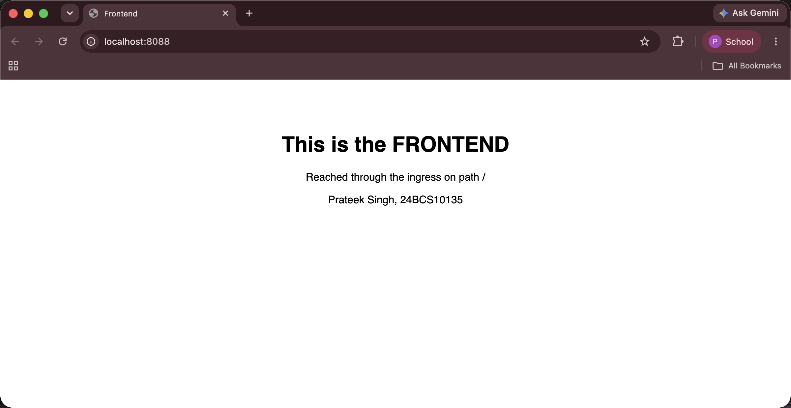
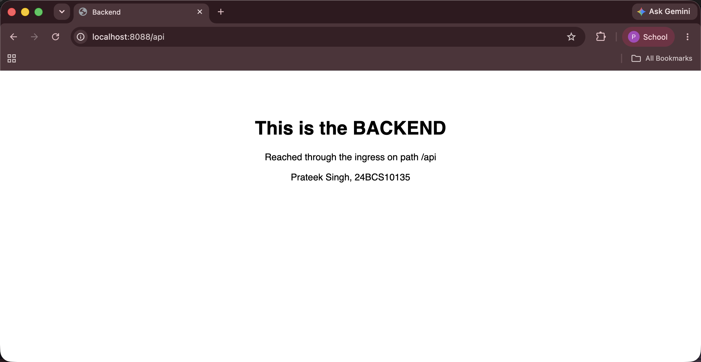

# Kubernetes Ingress, ConfigMaps and Secrets

**Name:** Prateek Singh
**Enrollment number:** 24BCS10135

## Homework tasks

- Install an Ingress controller.
- Create a ConfigMap and use it in an application.
- Create a Secret and use it in an application.
- Deploy two applications and inject the configuration into them.
- Create an Ingress that routes to both applications.

The cluster setup is in [kubernetes-fundamentals](../kubernetes-fundamentals). All the YAML
files are in [manifests](manifests).

## The idea

- A **ConfigMap** holds configuration that is not secret, as key value pairs.
- A **Secret** holds sensitive values like passwords.
- An **Ingress** is one entry point that routes to different Services by path or hostname.

The point of the first two is to keep configuration **out of the image**, so the same image
can run in development and production with different settings.

---

## 0. Install the Ingress controller

An Ingress object on its own does nothing. It is just a set of rules. Something has to read
those rules and actually route traffic, and that is the ingress controller. I used the nginx
one.

```bash
kubectl apply -f https://raw.githubusercontent.com/kubernetes/ingress-nginx/controller-v1.11.3/deploy/static/provider/kind/deploy.yaml

kubectl wait --namespace ingress-nginx \
  --for=condition=ready pod \
  --selector=app.kubernetes.io/component=controller --timeout=180s
```

```text
$ kubectl get pods -n ingress-nginx
NAME                                        READY   STATUS      RESTARTS      AGE
ingress-nginx-admission-create-rsrt6        0/1     Completed   0             56s
ingress-nginx-admission-patch-54sdw         0/1     Completed   2 (42s ago)   56s
ingress-nginx-controller-746c8469d8-cmmsv   1/1     Running     0             56s
```



The two `Completed` ones are Jobs that ran once to set up certificates and then finished, so
`0/1 Completed` is normal here and not a failure. The controller itself is `Running`.

I used the **kind** version of the install file, and my cluster config has this in it:

```yaml
extraPortMappings:
  - containerPort: 80
    hostPort: 8088
```

That is what lets me reach the ingress from my laptop on `localhost:8088`. I used 8088
because port 80 was already taken by a container from the Docker homework.

---

## 1. ConfigMap

[manifests/configmap.yaml](manifests/configmap.yaml):

```yaml
apiVersion: v1
kind: ConfigMap
metadata:
  name: app-config
data:
  APP_NAME: "DevOps 2028 Homework"
  APP_ENV: "development"
  WELCOME_MESSAGE: "Hello from a ConfigMap"
```

```text
$ kubectl apply -f manifests/configmap.yaml
configmap/app-config created

$ kubectl get configmap app-config -o yaml
data:
  APP_ENV: development
  APP_NAME: DevOps 2028 Homework
  WELCOME_MESSAGE: Hello from a ConfigMap
kind: ConfigMap
```

Stored as plain readable text, which is the point. It is not meant for anything sensitive.

---

## 2. Secret

[manifests/secret.yaml](manifests/secret.yaml):

```yaml
apiVersion: v1
kind: Secret
metadata:
  name: app-secret
type: Opaque
stringData:
  DB_USER: "prateek"
  DB_PASSWORD: "devops123"
```

I used `stringData` so I can write normal text and let Kubernetes encode it. With `data` I
would have to base64 encode the values myself first.

```text
$ kubectl get secret app-secret -o yaml
data:
  DB_PASSWORD: ZGV2b3BzMTIz
  DB_USER: cHJhdGVlaw==
kind: Secret
```

The values come back encoded, but **base64 is not encryption**, it is just a different way of
writing the same characters. Anyone who can read the Secret can decode it:

```text
$ kubectl get secret app-secret -o jsonpath='{.data.DB_USER}' | base64 -d
prateek
```



So a Secret is not safe just because it is a Secret. What it actually gives is that the value
is not sitting in the image or in the Deployment YAML, access can be restricted separately
with RBAC, and it is not printed by accident in normal `kubectl get` output. For real
secrets, encryption at rest or an external secret manager is needed on top.

Since the password is in a file in this repo, this one is only a practice value and not a
real password.

---

## 3. Deploy the applications and inject the configuration

Two Deployments, a frontend and a backend, each with a Service.

The frontend takes the whole ConfigMap as environment variables and one value out of the
Secret:

```yaml
          # every key of the ConfigMap becomes an environment variable
          envFrom:
            - configMapRef:
                name: app-config
          # and one value is taken out of the Secret
          env:
            - name: DB_PASSWORD
              valueFrom:
                secretKeyRef:
                  name: app-secret
                  key: DB_PASSWORD
```

The backend takes both whole objects:

```yaml
          envFrom:
            - configMapRef:
                name: app-config
            - secretRef:
                name: app-secret
```

`envFrom` brings in every key at once. `env` with `secretKeyRef` picks one key and lets me
rename it. Checking that it actually arrived inside the containers:

```text
$ kubectl exec deploy/frontend -- env | grep -E 'APP_NAME|APP_ENV|WELCOME_MESSAGE|DB_PASSWORD' | sort
APP_ENV=development
APP_NAME=DevOps 2028 Homework
DB_PASSWORD=devops123
WELCOME_MESSAGE=Hello from a ConfigMap

$ kubectl exec deploy/backend -- env | grep -E 'APP_NAME|APP_ENV|DB_USER|DB_PASSWORD' | sort
APP_ENV=development
APP_NAME=DevOps 2028 Homework
DB_PASSWORD=devops123
DB_USER=prateek
```



Both got the config, and the backend also got `DB_USER` because it pulled in the whole
Secret. Neither value is written anywhere in the Deployment files, they come from the
ConfigMap and the Secret at start up.

One thing worth knowing: environment variables are read **once when the container starts**.
Changing the ConfigMap afterwards does not update a running Pod, it needs a restart with
`kubectl rollout restart deployment/frontend`.

### A ConfigMap can also hold a whole file

To tell the two apps apart in the browser I put an `index.html` for each one in a ConfigMap
and mounted it as a file, [manifests/pages-configmap.yaml](manifests/pages-configmap.yaml):

```yaml
data:
  index.html: |
    <h1>This is the FRONTEND</h1>
```

```yaml
          # the page comes from a ConfigMap mounted as a file
          volumeMounts:
            - name: page
              mountPath: /usr/share/nginx/html
      volumes:
        - name: page
          configMap:
            name: frontend-page
```

So a ConfigMap can be used two ways: as environment variables, or mounted as files. Mounting
as a file is the one used for real config files like `nginx.conf`, and unlike environment
variables a mounted file does update when the ConfigMap changes.

---

## 4. Ingress

Without an Ingress, reaching two apps from outside would need two NodePorts on two different
ports. An Ingress gives one entry point that routes by path.

[manifests/ingress.yaml](manifests/ingress.yaml):

```yaml
apiVersion: networking.k8s.io/v1
kind: Ingress
metadata:
  name: app-ingress
  annotations:
    nginx.ingress.kubernetes.io/rewrite-target: /
spec:
  ingressClassName: nginx
  rules:
    - http:
        paths:
          - path: /
            pathType: Prefix
            backend:
              service:
                name: frontend
                port:
                  number: 80
          - path: /api
            pathType: Prefix
            backend:
              service:
                name: backend
                port:
                  number: 80
```

```text
$ kubectl get ingress
NAME          CLASS   HOSTS   ADDRESS   PORTS   AGE
app-ingress   nginx   *                 80      15s
```

Testing both paths from my laptop:

```text
$ curl -s http://localhost:8088/ | grep -o '<h1>.*</h1>'
<h1>This is the FRONTEND</h1>

$ curl -s http://localhost:8088/api | grep -o '<h1>.*</h1>'
<h1>This is the BACKEND</h1>
```



And in the browser:





Same host, same port, two different applications depending on the path. That is the whole
point of an Ingress.

Notes on the fields:

- `ingressClassName: nginx` says which controller should handle this. Without it, the nginx
  controller ignores the rules and nothing works.
- `pathType: Prefix` matches anything starting with that path. `Exact` matches only that
  exact path.
- The `rewrite-target` annotation strips the matched prefix before passing the request on, so
  the backend receives `/` instead of `/api`. Annotations like this are specific to the nginx
  controller.
- Order matters less than length, the most specific path wins, so `/api` is matched before
  `/` even though `/` is listed first.

---

## Ingress compared with a Service

| | Service (NodePort or LoadBalancer) | Ingress |
|---|---|---|
| Works at | TCP level | HTTP level |
| Routes by | Port | Hostname and URL path |
| Apps per entry point | One | Many |
| TLS | Handled by the app | Handled by the ingress |
| Needs a controller | No | Yes |

---

## Clean up

```bash
kubectl delete -f manifests/
kubectl delete -f https://raw.githubusercontent.com/kubernetes/ingress-nginx/controller-v1.11.3/deploy/static/provider/kind/deploy.yaml
```

## What I take away from this one

- ConfigMaps and Secrets keep configuration out of the image, so one image works in every
  environment.
- A Secret is base64, not encrypted. It is better than hardcoding, but it is not enough on
  its own for real secrets.
- `envFrom` takes the whole object and `env` with `secretKeyRef` picks one key. Environment
  variables are only read at start up, so changing a ConfigMap needs a restart. A mounted
  file does not.
- An Ingress is only rules. Nothing happens until a controller is installed to act on them.
- One Ingress can serve many apps on one port by routing on the path, which is why it is used
  instead of opening a NodePort per app.
