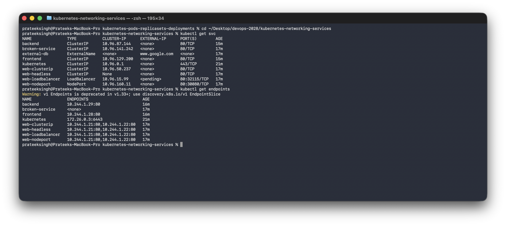
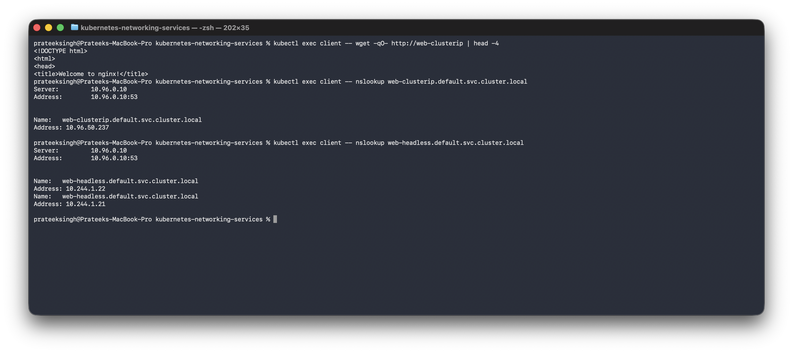
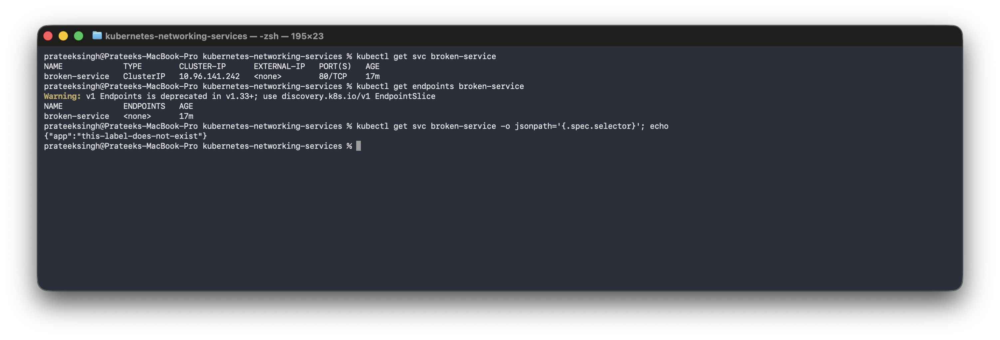
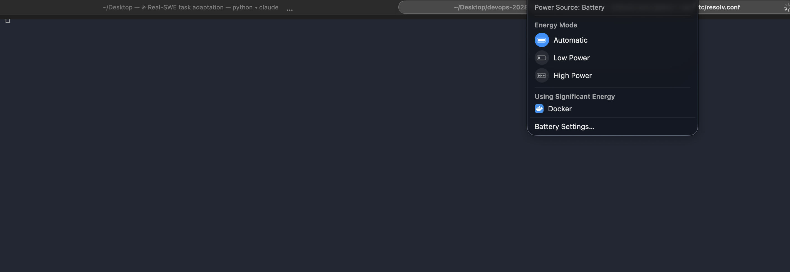
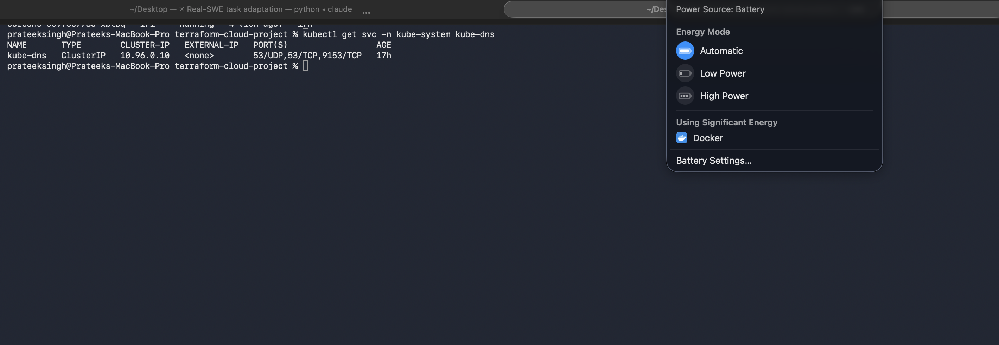

# Kubernetes Networking and Services

**Name:** Prateek Singh
**Enrollment number:** 24BCS10135

## Homework tasks

**Task 1: Kubernetes Services**: deploy and demonstrate all 5 Service types.

**Task 2: Object comparison**: Deployment vs ReplicaSet, Deployment vs DaemonSet vs
StatefulSet, and ReplicaSet vs Service.

**Task 3: FQDN**: what it is, the DNS naming convention, namespace based DNS, pod to Service
communication.

**Task 4: CoreDNS**: what it is, why Kubernetes uses it, how service discovery works, how
queries resolve, its configuration, and how to troubleshoot DNS.

The detail of task 1:

- Understand why Services are needed.
- Practise the Service types: ClusterIP, NodePort, LoadBalancer, ExternalName and headless.
- Check how Pods reach each other by name.
- Troubleshoot a Service that has no endpoints.

The cluster setup is in [kubernetes-fundamentals](../kubernetes-fundamentals). All the YAML
files are in [manifests](manifests).

## Why Services exist

Every Pod gets its own IP, but Pod IPs are not something I can rely on. When a Pod is
replaced, in a rolling update or after a crash, the new Pod gets a **different IP**. I saw
this in the Deployment homework, where the Pods were replaced one by one and all got new
names and new IPs.

So hardcoding a Pod IP anywhere would break the next time anything restarts.

A **Service** is a fixed name and a fixed IP in front of a group of Pods. It finds its Pods
with a label selector, so when Pods come and go the Service just points at whichever ones
currently match.

## The app behind all the Services

[manifests/app-deployment.yaml](manifests/app-deployment.yaml) runs 2 nginx Pods labelled
`app: web-app`. Every Service below selects that label.

```text
$ kubectl get pods -l app=web-app -o wide
NAME                       READY   STATUS    RESTARTS   AGE   IP            NODE
web-app-64d68fc7f4-g9hk4   1/1     Running   0          6s    10.244.1.22   devops-2028-worker
web-app-64d68fc7f4-srstn   1/1     Running   0          6s    10.244.1.21   devops-2028-worker
```

## All the Services together

```text
$ kubectl get svc
NAME               TYPE           CLUSTER-IP      EXTERNAL-IP      PORT(S)        AGE
broken-service     ClusterIP      10.96.141.242   <none>           80/TCP         6s
external-db        ExternalName   <none>          www.google.com   <none>         6s
kubernetes         ClusterIP      10.96.0.1       <none>           443/TCP        4m4s
web-clusterip      ClusterIP      10.96.50.237    <none>           80/TCP         6s
web-headless       ClusterIP      None            <none>           80/TCP         6s
web-loadbalancer   LoadBalancer   10.96.15.99     <pending>        80:32115/TCP   6s
web-nodeport       NodePort       10.96.160.11    <none>           80:30080/TCP   6s
```

---

## 1. ClusterIP

The default type. It gets an IP that only works **inside** the cluster.

```yaml
apiVersion: v1
kind: Service
metadata:
  name: web-clusterip
spec:
  type: ClusterIP
  selector:
    app: web-app
  ports:
    - port: 80
      targetPort: 80
```

`port` is the port on the Service and `targetPort` is the port on the Pod.

To test it I ran a small busybox Pod and called the Service **by name**:

```text
$ kubectl run client --image=busybox:1.37 --restart=Never --command -- sleep 3600

$ kubectl exec client -- wget -qO- http://web-clusterip
<!DOCTYPE html>
<html>
<head>
<title>Welcome to nginx!</title>
```

It worked with just the name `web-clusterip`, no IP anywhere. That is CoreDNS doing the work:

```text
$ kubectl exec client -- nslookup web-clusterip.default.svc.cluster.local
Server:		10.96.0.10
Address:	10.96.0.10:53

Name:	web-clusterip.default.svc.cluster.local
Address: 10.96.50.237
```

The full DNS name is `servicename.namespace.svc.cluster.local`. Inside the same namespace the
short name is enough.

### Endpoints

This was the part that made Services click for me:

```text
$ kubectl get endpoints
NAME               ENDPOINTS                       AGE
broken-service     <none>                          6s
kubernetes         172.26.0.3:6443                 4m4s
web-clusterip      10.244.1.21:80,10.244.1.22:80   6s
web-headless       10.244.1.21:80,10.244.1.22:80   6s
web-loadbalancer   10.244.1.21:80,10.244.1.22:80   6s
web-nodeport       10.244.1.21:80,10.244.1.22:80   6s
```



The endpoints are exactly the two Pod IPs from earlier. So a Service is really just a stable
name plus a list of Pod IPs that Kubernetes keeps up to date. When a Pod is replaced, its old
IP drops off the list and the new one is added.

---

## 2. NodePort

NodePort opens the same port on **every node**, so something outside the cluster can reach
it.

```yaml
spec:
  type: NodePort
  selector:
    app: web-app
  ports:
    - port: 80
      targetPort: 80
      nodePort: 30080
```

```text
$ kubectl get svc web-nodeport
NAME           TYPE       CLUSTER-IP      EXTERNAL-IP   PORT(S)        AGE
web-nodeport   NodePort   10.96.160.11    <none>        80:30080/TCP   6s
```

`80:30080/TCP` means port 80 on the Service and port 30080 on every node. Reaching it through
a node IP:

```text
$ kubectl exec client -- wget -qO- http://172.26.0.2:30080
<title>Welcome to nginx!</title>
```

`172.26.0.2` is the worker node's IP from `kubectl get nodes -o wide`.

The node port has to be in the range **30000 to 32767**. If I leave `nodePort` out,
Kubernetes picks one from that range itself.

A NodePort still has a ClusterIP as well, so it works from inside the cluster too. NodePort
is built on top of ClusterIP rather than replacing it.

---

## 3. LoadBalancer

LoadBalancer asks the cloud provider for a real external load balancer.

```text
$ kubectl get svc web-loadbalancer
NAME               TYPE           CLUSTER-IP    EXTERNAL-IP   PORT(S)        AGE
web-loadbalancer   LoadBalancer   10.96.15.99   <pending>     80:32115/TCP   6s
```

**`EXTERNAL-IP` stays `<pending>` forever on my laptop**, and that is the correct result
rather than a mistake. LoadBalancer only works when something is there to answer the request,
like AWS, GCP or Azure. My cluster is kind running in Docker, so nobody answers and it waits.

It is still useful to see what it did: it allocated a ClusterIP **and** a node port `32115`
anyway. So the types stack up: LoadBalancer is a NodePort with a cloud load balancer in
front, and NodePort is a ClusterIP opened on the nodes.

On a real cloud the `EXTERNAL-IP` would fill in with a public address after a minute.

---

## 4. ExternalName

This one does not point at Pods at all. It is a DNS alias to something outside the cluster.

```yaml
spec:
  type: ExternalName
  externalName: www.google.com
```

```text
$ kubectl exec client -- nslookup external-db
Name:	www.google.com
Address: 142.251.154.119
Name:	www.google.com
Address: 142.251.155.119
```

Asking for `external-db` returned the addresses of `www.google.com`. Notice it has no
CLUSTER-IP in `kubectl get svc`, because there is nothing to route, it is only a DNS record.

This is used when an app should keep calling something like `database` inside the cluster,
but the real database lives outside on a managed service. Moving it later only means changing
this one Service instead of the app.

---

## 5. Headless Service

A headless Service has `clusterIP: None`. Instead of one Service IP, DNS returns **all the
Pod IPs**.

```yaml
spec:
  clusterIP: None
  selector:
    app: web-app
  ports:
    - port: 80
```

```text
$ kubectl exec client -- nslookup web-headless
Name:	web-headless.default.svc.cluster.local
Address: 10.244.1.21
Name:	web-headless.default.svc.cluster.local
Address: 10.244.1.22
```



In the screenshot the two lookups are next to each other, which makes the difference obvious.
The ClusterIP one answers with the single Service IP `10.96.50.237` and the headless one
answers with both Pod IPs.

Two addresses came back instead of one, and they are the two Pod IPs.

Compared with the ClusterIP Service earlier, which returned the single address
`10.96.50.237`, this returns the Pods directly and there is no load balancing in the middle.

That matters for something like a database cluster, where the app needs to talk to one
specific member, for example the primary, rather than a random one. Databases running as a
StatefulSet use a headless Service for exactly that.

---

## 6. Troubleshooting: a Service with no endpoints

The most common Service problem is a selector that does not match any Pod. I made one on
purpose, [manifests/wrong-selector-service.yaml](manifests/wrong-selector-service.yaml):

```yaml
spec:
  selector:
    app: this-label-does-not-exist
```

```text
$ kubectl get svc broken-service
NAME             TYPE        CLUSTER-IP      EXTERNAL-IP   PORT(S)   AGE
broken-service   ClusterIP   10.96.141.242   <none>        80/TCP    6s

$ kubectl get endpoints
NAME             ENDPOINTS   AGE
broken-service   <none>      6s
```



The Service looks completely healthy in `kubectl get svc`. It has a type, a cluster IP and a
port, and there is no error anywhere. But its endpoints are `<none>`, so any request to it
just fails to connect.

**So `kubectl get endpoints` is the command to run when a Service is not working.** If the
endpoints are empty, the selector does not match the Pod labels. The fix is to compare:

```bash
kubectl get svc broken-service -o jsonpath='{.spec.selector}'
kubectl get pods --show-labels
```

and make them agree.

---

## The types side by side

| Type | Reachable from | Gets a cluster IP | Typical use |
|---|---|---|---|
| ClusterIP | Inside the cluster only | Yes | Services talking to each other. The default |
| NodePort | Outside, on `nodeIP:30000-32767` | Yes | Testing, or small setups without a cloud |
| LoadBalancer | Outside, on a real IP | Yes | Production on a cloud provider |
| ExternalName | It is only a DNS alias | No | Pointing at something outside the cluster |
| Headless | Inside, straight to the Pod IPs | No (`None`) | StatefulSets and databases |

## Clean up

```bash
kubectl delete -f manifests/
kubectl delete pod client
```

## Main points

- Pod IPs change, so nothing should point at them. A Service is the stable name in front.
- A Service is really a name plus a list of endpoints, and the endpoint list is just the IPs
  of the Pods whose labels match the selector.
- The types build on each other. NodePort is ClusterIP plus a port on every node, and
  LoadBalancer is NodePort plus a cloud load balancer.
- `<pending>` on a LoadBalancer on a local cluster is the expected result, not a bug.
- When a Service does not work, `kubectl get endpoints` is the fastest check. Empty endpoints
  means the selector and the Pod labels do not match.

---

# Task 2: Comparing the objects

## Deployment vs ReplicaSet

| | ReplicaSet | Deployment |
|---|---|---|
| Purpose | Keep N identical pods running | Manage ReplicaSets so versions can change |
| Pod management | Creates and deletes pods to hit the count | Does it through a ReplicaSet |
| Scaling | Yes | Yes, passes it down |
| Rolling updates | **No** | Yes |
| Rollback | No | `kubectl rollout undo` |
| Used directly | Rarely | Almost always |

**The relationship:** a Deployment creates a ReplicaSet, and the ReplicaSet creates the pods.

```
Deployment  ->  ReplicaSet  ->  Pods
```

I saw this in [session 10](../kubernetes-pods-replicasets-deployments): creating only a
Deployment produced a ReplicaSet I never asked for, and the pod names showed the chain,
`web-deploy-b68785c99-7xscv` being deployment, then replicaset hash, then pod.

Changing the image created a **second** ReplicaSet and scaled the first to 0 rather than
deleting it. That retained old ReplicaSet is exactly what a rollback scales back up. A bare
ReplicaSet cannot do that, which is the whole reason Deployments exist.

## Deployment vs DaemonSet vs StatefulSet

| | Deployment | DaemonSet | StatefulSet |
|---|---|---|---|
| Use case | Stateless apps | One agent per node | Databases, anything with identity |
| Pod creation | N identical pods, anywhere | **One per node**, automatically | Ordered, one at a time |
| Pod names | Random suffix | Random suffix | **Stable**: `db-0`, `db-1` |
| Scaling | Set a replica count | Follows the node count | Ordered up and down |
| Networking | One Service load balances | Usually node local | Headless Service, one DNS name per pod |
| Storage | Usually shared or none | Usually hostPath | **One PVC per pod**, kept on restart |
| Example | Web app, API | Log collector, node-exporter | PostgreSQL, Kafka |

The DaemonSet point is the one I proved: it said `DESIRED 2` without me writing any replica
count, because my cluster has 2 nodes. Add a node, get a pod.

The StatefulSet difference is identity. A Deployment's pods are interchangeable, so replacing
one is fine. A database replica is not interchangeable: it has its own data and other members
need to find that specific one. StatefulSet gives stable names and keeps each pod's PVC
attached to it across restarts.

The node-exporter pods in [session 20](../monitoring-observability-gitops) are a real DaemonSet,
one per node, for exactly that reason.

## ReplicaSet vs Service

These two are not alternatives, they solve different halves of the same problem.

| | ReplicaSet | Service |
|---|---|---|
| Responsibility | **How many** pods exist | **How to reach** them |
| Keeps count correct | Yes | No |
| Gives a stable address | No | Yes |
| Load balances | No | Yes |
| Knows about pods via | Its own label selector | A label selector |

**Why a Service is needed at all:** a ReplicaSet keeps 3 pods running, but if one dies the
replacement has a **different IP**. Anything that had stored the old IP is now talking to
nothing. That is the problem from the top of this file.

**How traffic reaches the pods:**

```
client
  |  asks DNS for "web-clusterip"
  v
CoreDNS answers with the Service ClusterIP  (10.96.50.237)
  |
  v
kube-proxy rules on the node rewrite the destination
  |
  v
one of the pod IPs from the endpoint list  (10.244.1.21 or .22)
```

The endpoint list is what links them: the Service watches for pods matching its selector, and
the same labels the ReplicaSet uses to count pods are what the Service uses to find them. Both
work off labels, which is why a selector typo breaks one or the other.

---

# Task 3: FQDN

## What an FQDN is

A fully qualified domain name is the complete name with nothing left to guess. In Kubernetes
every Service gets one.

```
<service>.<namespace>.svc.cluster.local
```

| Part | Meaning |
|---|---|
| `service` | The Service name |
| `namespace` | Which namespace it lives in |
| `svc` | It is a Service, as opposed to a pod |
| `cluster.local` | The cluster domain |

## It working

```text
$ kubectl exec bgtest -- nslookup other-app.dns-demo.svc.cluster.local
Name:	other-app.dns-demo.svc.cluster.local
Address: 10.96.61.126
```

That Service is in the `dns-demo` namespace and I queried from a pod in `default`.



## Namespace based DNS

The short name does **not** work across namespaces:

```text
$ kubectl exec bgtest -- nslookup other-app
** server can't find other-app.svc.cluster.local: NXDOMAIN
command terminated with exit code 1
```

The reason is in the pod's resolver configuration:

```text
$ kubectl exec bgtest -- cat /etc/resolv.conf
search default.svc.cluster.local svc.cluster.local cluster.local
nameserver 10.96.0.10
options ndots:5
```

The `search` line is what makes short names work. Asking for `other-app` makes the resolver try
`other-app.default.svc.cluster.local` first, because my pod is in `default`. That does not
exist, since the Service is in `dns-demo`.

So the rule is:

| From where | What to use |
|---|---|
| Same namespace | `other-app` |
| Different namespace | `other-app.dns-demo` |
| Anywhere, unambiguous | `other-app.dns-demo.svc.cluster.local` |

`ndots:5` is worth knowing because it bites in production. Any name with fewer than 5 dots gets
tried against every search domain first, so looking up `api.github.com` (2 dots) makes three
failed cluster lookups before the real one. On a busy service that is a lot of wasted DNS
traffic, and the fix is a trailing dot, `api.github.com.`, or a custom `dnsConfig`.

## Pod to Service communication

This is what [session 11's](README.md) ClusterIP test did: `wget http://web-clusterip` worked
with no IP anywhere, because DNS resolved the name to the Service IP and kube-proxy forwarded
it to a pod.

Pods have DNS names too, with dashes instead of dots in the IP:
`10-244-1-21.default.pod.cluster.local`. Rarely used directly, except with StatefulSets where
the headless Service gives each pod a stable name like `db-0.db.default.svc.cluster.local`.

---

# Task 4: CoreDNS

## What it is

CoreDNS is the DNS server inside the cluster. It is what answers every name lookup a pod makes,
and it is just pods like anything else:

```text
$ kubectl get pods -n kube-system -l k8s-app=kube-dns
  coredns-559f6c778d-5jv98  Running
  coredns-559f6c778d-xbtbq  Running

$ kubectl get svc -n kube-system kube-dns
  kube-dns  10.96.0.10  53/UDP,53/TCP,9153/TCP
```

`10.96.0.10` is the same address that appeared as `nameserver` in the pod's `/etc/resolv.conf`.
That is the whole link: the kubelet writes that address into every pod it starts.

Two replicas because DNS failing takes the whole cluster down with it.



## Why Kubernetes uses it

Pod IPs change constantly, so something has to translate stable names into current addresses.
CoreDNS replaced the older kube-dns because it is one Go binary with a plugin chain instead of
three containers, it is easier to extend, and it is a CNCF project used outside Kubernetes too.

## How service discovery works

1. A Service is created.
2. The API server records it, and an endpoint list is kept up to date with the matching pod IPs.
3. CoreDNS watches the API server for Services and Endpoints.
4. A pod looks up the Service name.
5. CoreDNS answers with the ClusterIP.
6. kube-proxy's rules on the node forward that to one of the pod IPs.

Nobody edits a DNS zone file. CoreDNS builds its answers from the API server directly.

For a **headless** Service there is no ClusterIP, so step 5 returns the pod IPs instead, which
is what the two addresses in the headless test earlier were.

## The configuration

CoreDNS is configured by a Corefile in a ConfigMap:

```text
$ kubectl get configmap coredns -n kube-system -o jsonpath='{.data.Corefile}'
.:53 {
    errors
    health {
       lameduck 5s
    }
    ready
    kubernetes cluster.local in-addr.arpa ip6.arpa {
       pods insecure
       fallthrough in-addr.arpa ip6.arpa
       ttl 30
    }
    prometheus :9153
    forward . /etc/resolv.conf {
       max_concurrent 1000
    }
    cache 30 {
       disable success cluster.local
       disable denial cluster.local
    }
```

Reading the plugins:

| Plugin | What it does |
|---|---|
| `errors` | Log errors |
| `health` / `ready` | Endpoints for the probes |
| `kubernetes cluster.local` | Answer for the cluster domain from the API server |
| `forward . /etc/resolv.conf` | **Anything else goes to the node's upstream DNS** |
| `cache 30` | Cache answers for 30 seconds |
| `prometheus :9153` | Expose metrics, which is why port 9153 is on the Service |

The `forward` line is how a pod reaches `github.com`. Cluster names are answered locally and
everything else is passed upstream.

## Troubleshooting DNS

```bash
# does the name resolve at all
kubectl exec <pod> -- nslookup my-service.my-namespace.svc.cluster.local

# is the resolver configured correctly
kubectl exec <pod> -- cat /etc/resolv.conf     # nameserver should be the kube-dns ClusterIP

# are the CoreDNS pods healthy
kubectl get pods -n kube-system -l k8s-app=kube-dns
kubectl logs -n kube-system -l k8s-app=kube-dns --tail=30

# does the Service even have backends
kubectl get endpoints my-service
```

A check I use to prove DNS itself is fine before blaming it:

```text
$ kubectl exec bgtest -- nslookup kubernetes.default.svc.cluster.local
Name:	kubernetes.default.svc.cluster.local
Address: 10.96.0.1
```

That Service always exists, so if it resolves then CoreDNS is working and the problem is the
specific Service, not DNS.

Telling the failures apart, which is the same distinction as the ping failures in
[the networking homework](../networking):

| Symptom | Likely cause |
|---|---|
| `NXDOMAIN` for a short name | Wrong namespace, use the FQDN |
| `NXDOMAIN` for the FQDN | The Service does not exist |
| Resolves, but connection refused | Wrong `targetPort`, or nothing listening |
| Resolves, but times out | Endpoints empty, or a network policy blocking it |
| Everything fails, including `kubernetes.default` | CoreDNS itself is down |
