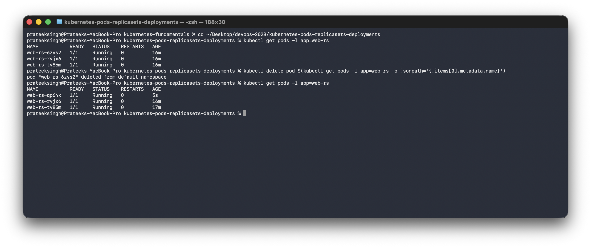
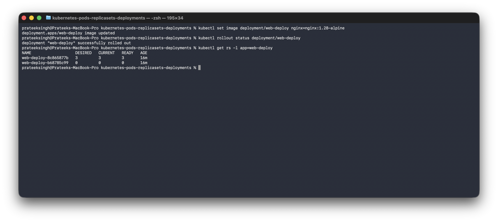
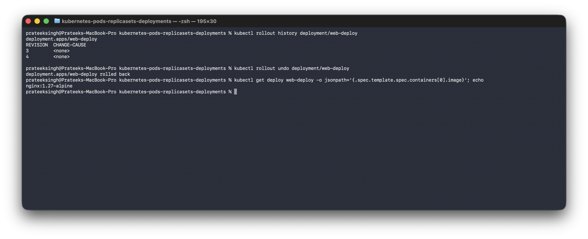
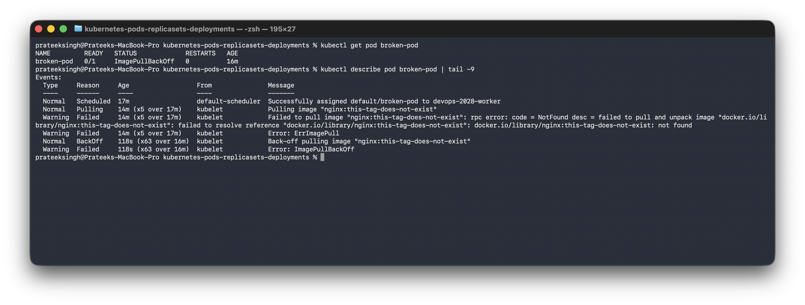
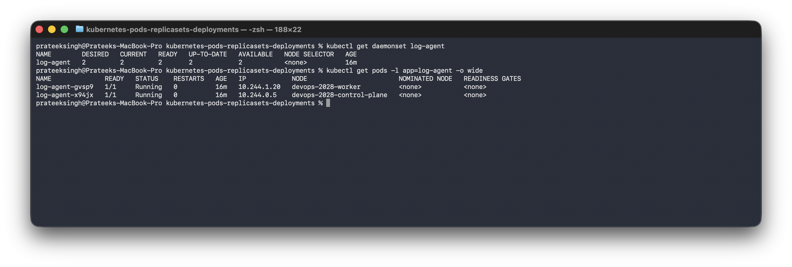

# Kubernetes Pods, ReplicaSets and Deployments

**Name:** Prateek Singh
**Enrollment number:** 24BCS10135

## Homework tasks

- Create a Pod and understand it.
- Create a ReplicaSet and see self healing and scaling.
- Create a Deployment, do a rolling update, check the history and roll back.
- Troubleshoot a Pod that will not start.
- Understand DaemonSets.

The cluster setup is in [kubernetes-fundamentals](../kubernetes-fundamentals). All the YAML
files are in [manifests](manifests).

## How these three fit together

This was the part I had to get straight first:

```
Deployment  ->  manages  ->  ReplicaSet  ->  manages  ->  Pods
```

- A **Pod** runs the containers. On its own, if it dies, it stays dead.
- A **ReplicaSet** keeps a fixed number of identical Pods alive.
- A **Deployment** manages ReplicaSets, which is what gives rolling updates and rollbacks.

In real work you almost always create a Deployment and let it make the other two.

---

## 1. Pod

[manifests/pod.yaml](manifests/pod.yaml):

```yaml
apiVersion: v1
kind: Pod
metadata:
  name: nginx-pod
  labels:
    app: nginx-pod
spec:
  containers:
    - name: nginx
      image: nginx:alpine
      ports:
        - containerPort: 80
```

```text
$ kubectl apply -f manifests/pod.yaml
pod/nginx-pod created

$ kubectl get pods -o wide
NAME        READY   STATUS    RESTARTS   AGE   IP           NODE
first-pod   1/1     Running   0          47s   10.244.1.2   devops-2028-worker
nginx-pod   1/1     Running   0          1s    10.244.1.3   devops-2028-worker
```

A bare Pod like this has nothing watching it. If I delete it, nothing brings it back. That is
the problem the next object solves.

---

## 2. ReplicaSet

A ReplicaSet keeps a set number of Pods running. It knows which Pods are its own through the
`selector`, which has to match the labels in the `template`.

[manifests/replicaset.yaml](manifests/replicaset.yaml):

```yaml
apiVersion: apps/v1
kind: ReplicaSet
metadata:
  name: web-rs
spec:
  replicas: 3
  # the selector tells the ReplicaSet which Pods belong to it
  selector:
    matchLabels:
      app: web-rs
  template:
    metadata:
      labels:
        app: web-rs
    spec:
      containers:
        - name: nginx
          image: nginx:alpine
          ports:
            - containerPort: 80
```

```text
$ kubectl apply -f manifests/replicaset.yaml
replicaset.apps/web-rs created

$ kubectl get rs
NAME     DESIRED   CURRENT   READY   AGE
web-rs   3         3         3       12s

$ kubectl get pods -l app=web-rs
NAME           READY   STATUS    RESTARTS   AGE
web-rs-5zhcl   1/1     Running   0          12s
web-rs-g5xnp   1/1     Running   0          12s
web-rs-tv85m   1/1     Running   0          12s
```

The Pod names are the ReplicaSet name plus a random ending, because I did not name them, the
ReplicaSet made them.

### Self healing

I deleted one Pod on purpose:

```text
$ kubectl delete pod web-rs-5zhcl
pod "web-rs-5zhcl" deleted from default namespace

$ kubectl get pods -l app=web-rs
NAME           READY   STATUS    RESTARTS   AGE
web-rs-8j7g5   1/1     Running   0          9s
web-rs-g5xnp   1/1     Running   0          21s
web-rs-tv85m   1/1     Running   0          21s
```



There are still 3 Pods. `web-rs-5zhcl` is gone and `web-rs-8j7g5` appeared in its place, and
its age is 9 seconds while the other two are 21 seconds. Nobody told it to do that. The
controller noticed 2 Pods when the desired number was 3 and made one more. This is the
declarative idea actually working.

### Scaling

```text
$ kubectl scale rs web-rs --replicas=5
replicaset.apps/web-rs scaled

$ kubectl get rs web-rs
NAME     DESIRED   CURRENT   READY   AGE
web-rs   5         5         5       30s
```

Changing `replicas` in the YAML and running `kubectl apply` again does exactly the same
thing.

**What a ReplicaSet cannot do** is change the image without deleting everything at once,
which would mean downtime. That is why Deployments exist.

---

## 3. Deployment

[manifests/deployment.yaml](manifests/deployment.yaml) is the same app but as a Deployment,
starting on `nginx:1.27-alpine`.

```text
$ kubectl apply -f manifests/deployment.yaml
deployment.apps/web-deploy created

$ kubectl get deploy,rs,pods -l app=web-deploy
NAME                                   DESIRED   CURRENT   READY   AGE
replicaset.apps/web-deploy-b68785c99   3         3         1       12s

NAME                             READY   STATUS              RESTARTS   AGE
pod/web-deploy-b68785c99-7xscv   0/1     ContainerCreating   0          12s
pod/web-deploy-b68785c99-94gtx   0/1     ContainerCreating   0          12s
pod/web-deploy-b68785c99-lxp2h   1/1     Running             0          12s
```

I only created a Deployment, but a ReplicaSet appeared as well, and it created the Pods. The
Pod names show the chain: `web-deploy` (deployment) then `b68785c99` (replicaset) then a
random part (pod).

### Rolling update

```text
$ kubectl set image deployment/web-deploy nginx=nginx:1.28-alpine
deployment.apps/web-deploy image updated

$ kubectl rollout status deployment/web-deploy
Waiting for deployment "web-deploy" rollout to finish: 1 out of 3 new replicas have been updated...
Waiting for deployment "web-deploy" rollout to finish: 2 out of 3 new replicas have been updated...
Waiting for deployment "web-deploy" rollout to finish: 1 old replicas are pending termination...
deployment "web-deploy" successfully rolled out
```

It replaced them one at a time instead of all at once, so the app stayed up the whole time.

```text
$ kubectl get rs -l app=web-deploy
NAME                   DESIRED   CURRENT   READY   AGE
web-deploy-8c865877b   3         3         3       17s
web-deploy-b68785c99   0         0         0       29s
```



**There are two ReplicaSets now.** The new one has 3 Pods and the old one was scaled down to
0 but was not deleted. That is the trick behind rollbacks: the old ReplicaSet is kept so it
can be scaled back up.

### History and rollback

```text
$ kubectl rollout history deployment/web-deploy
deployment.apps/web-deploy
REVISION  CHANGE-CAUSE
1         <none>
2         <none>

$ kubectl get deploy web-deploy -o jsonpath='{.spec.template.spec.containers[0].image}'
nginx:1.28-alpine

$ kubectl rollout undo deployment/web-deploy
deployment.apps/web-deploy rolled back

$ kubectl rollout status deployment/web-deploy
deployment "web-deploy" successfully rolled out

$ kubectl get deploy web-deploy -o jsonpath='{.spec.template.spec.containers[0].image}'
nginx:1.27-alpine
```



Back on 1.27 without me typing the version anywhere. The rollback is just Kubernetes scaling
the old ReplicaSet back up and the new one down.

`CHANGE-CAUSE` says `<none>` because I did not record a reason. Adding `--record` or an
annotation puts a message there, which would be more useful on a real team.

---

## 4. Troubleshooting a Pod that will not start

I broke one on purpose with a tag that does not exist,
[manifests/broken-pod.yaml](manifests/broken-pod.yaml):

```yaml
spec:
  containers:
    - name: nginx
      image: nginx:this-tag-does-not-exist
```

```text
$ kubectl apply -f manifests/broken-pod.yaml
pod/broken-pod created

$ kubectl get pod broken-pod
NAME         READY   STATUS             RESTARTS   AGE
broken-pod   0/1     ImagePullBackOff   0          26s
```

`kubectl get` says the status but not the reason. `describe` has the reason:

```text
$ kubectl describe pod broken-pod
Events:
  Type     Reason     Age                From               Message
  ----     ------     ----               ----               -------
  Normal   Scheduled  26s                default-scheduler  Successfully assigned default/broken-pod to devops-2028-worker
  Normal   BackOff    23s                kubelet            Back-off pulling image "nginx:this-tag-does-not-exist"
  Warning  Failed     23s                kubelet            Error: ImagePullBackOff
  Normal   Pulling    12s (x2 over 25s)  kubelet            Pulling image "nginx:this-tag-does-not-exist"
  Warning  Failed     11s (x2 over 24s)  kubelet            Failed to pull image "nginx:this-tag-does-not-exist": ... not found
  Warning  Failed     11s (x2 over 24s)  kubelet            Error: ErrImagePull
```



The last line gives the actual reason: the image was not found. This is the same lesson as
`journalctl` in the Linux homework, the short status tells me something is wrong and the
detailed view tells me why.

`ErrImagePull` is the first failure and `ImagePullBackOff` is what it becomes after
Kubernetes starts waiting longer between retries, which is why it keeps trying with `x2 over
25s` instead of hammering the registry.

Note that `kubectl logs broken-pod` would not help here, because the container never started,
so there are no logs. For this kind of failure `describe` is the tool.

### Pod statuses worth knowing

| Status | What it means |
|---|---|
| `Running` | Working |
| `Pending` | Not placed on a node yet, often no node has room |
| `ContainerCreating` | Placed, image is being pulled or the container is starting |
| `ErrImagePull` / `ImagePullBackOff` | The image name or tag is wrong, or the registry needs a login |
| `CrashLoopBackOff` | The container starts and then exits over and over. Use `kubectl logs` for this one |
| `Completed` | It ran and finished, normal for a Job |

---

## 5. DaemonSet

A DaemonSet runs **one copy of a Pod on every node**, instead of a fixed number. It is used
for things every machine needs, like a log collector or a monitoring agent.

[manifests/daemonset.yaml](manifests/daemonset.yaml):

```yaml
apiVersion: apps/v1
kind: DaemonSet
metadata:
  name: log-agent
spec:
  selector:
    matchLabels:
      app: log-agent
  template:
    metadata:
      labels:
        app: log-agent
    spec:
      # this toleration lets the DaemonSet also run on the control plane node
      tolerations:
        - key: node-role.kubernetes.io/control-plane
          operator: Exists
          effect: NoSchedule
      containers:
        - name: agent
          image: busybox:1.37
          command: ["sh", "-c", "while true; do echo agent running on $(hostname); sleep 30; done"]
```

```text
$ kubectl apply -f manifests/daemonset.yaml
daemonset.apps/log-agent created

$ kubectl get daemonset log-agent
NAME        DESIRED   CURRENT   READY   UP-TO-DATE   AVAILABLE   NODE SELECTOR   AGE
log-agent   2         2         2       2            2           <none>          15s

$ kubectl get pods -l app=log-agent -o wide
NAME              READY   STATUS    RESTARTS   AGE   IP            NODE
log-agent-gvsp9   1/1     Running   0          15s   10.244.1.20   devops-2028-worker
log-agent-x94jx   1/1     Running   0          15s   10.244.0.5    devops-2028-control-plane
```



I never wrote a replica count. It says `DESIRED 2` because my cluster has 2 nodes, and there
is exactly one Pod on each. If I added a third node, a third Pod would appear on its own.

The `tolerations` part was needed. The control plane node has a taint on it that keeps normal
Pods away, so without the toleration the DaemonSet would only have run on the worker and
would have said `DESIRED 1`.

---

## Clean up

```bash
kubectl delete -f manifests/
```

## Things I want to remember

- A bare Pod has nothing looking after it. A ReplicaSet keeps the count right, and a
  Deployment manages ReplicaSets so updates can happen gradually.
- Self healing is real. I deleted a Pod and a new one appeared without me doing anything.
- A rolling update makes a **second** ReplicaSet and moves Pods over one at a time. The old
  one stays at 0 replicas, and that is what makes `rollout undo` possible.
- `kubectl get` tells me something is wrong and `kubectl describe` tells me why. For a
  crashing container it is `kubectl logs` instead, because the container at least started.
- A DaemonSet counts nodes instead of replicas.
