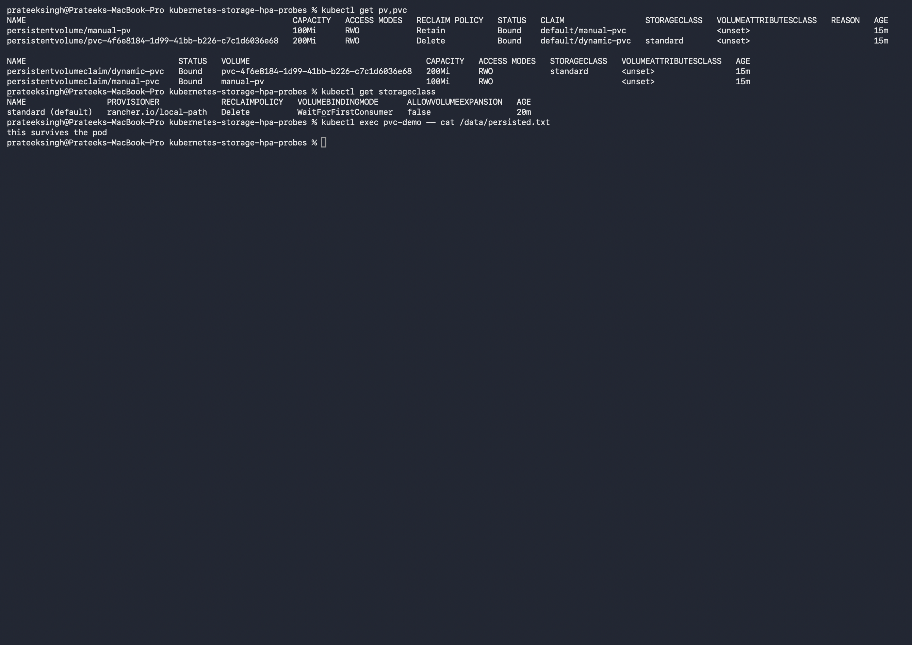
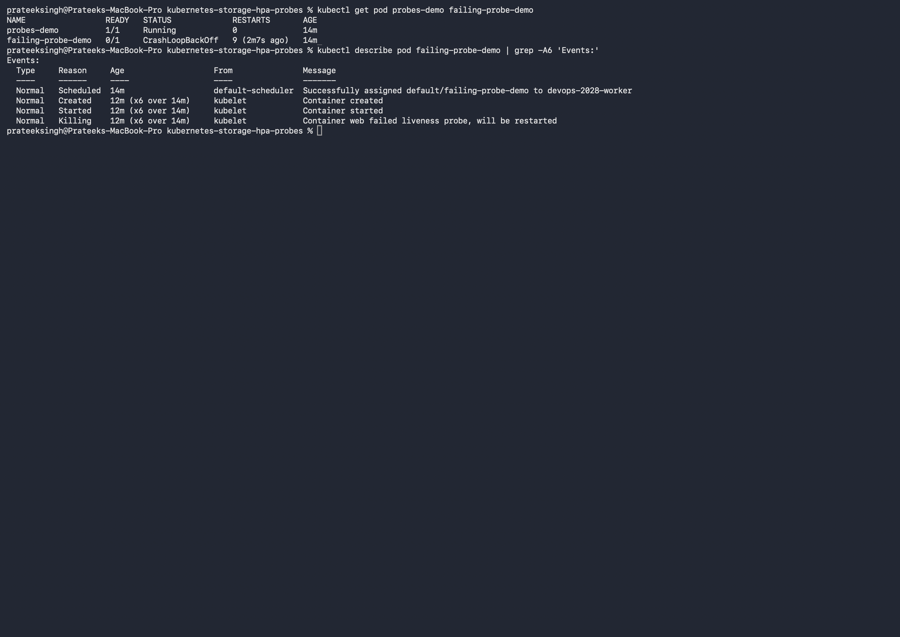
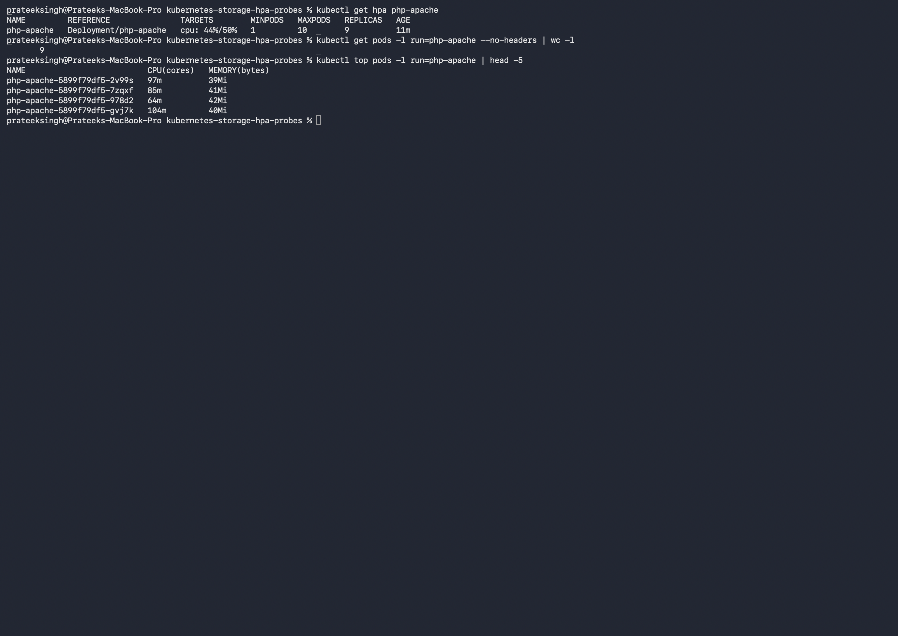
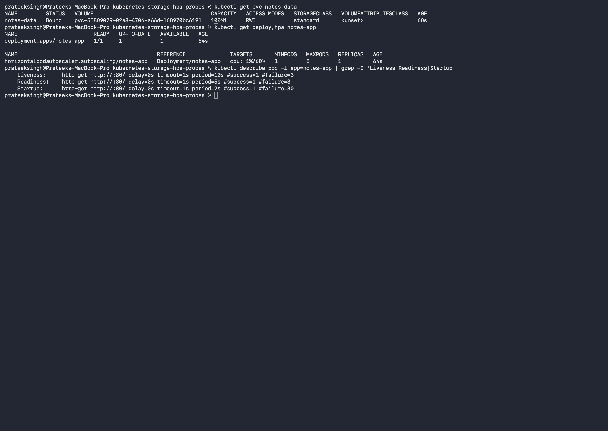

# Kubernetes Storage, HPA and Probes (Session 13)

**Name:** Prateek Singh
**Enrollment number:** 24BCS10135

## Homework tasks

**Task 1: Kubernetes Volumes**: document emptyDir, hostPath, PersistentVolume,
PersistentVolumeClaim, StorageClass and dynamic provisioning, with practical examples.

**Task 2: HPA hands-on**: deploy the app, configure HPA, verify it, deploy a load
generator, increase the load, watch CPU and Pod scaling, and capture the output.

**Task 3: Mini project**: put storage, probes and HPA together in one app.

Cluster is the same kind cluster from [kubernetes-fundamentals](../kubernetes-fundamentals).
All YAML is in [manifests](manifests).

---

# Task 1: Volumes

## Why volumes exist

A container filesystem disappears when the container is replaced. I saw this in the Docker
homework when a file I made inside a container was gone after `docker rm`. Kubernetes has the
same problem, except Pods get replaced far more often, so anything worth keeping has to live
in a volume.

## emptyDir

An empty folder created when the Pod starts. It lives as long as the **Pod**, and every
container in that Pod shares it. When the Pod is deleted the data goes with it.

[manifests/01-emptydir.yaml](manifests/01-emptydir.yaml) has two containers, one writes and
one reads:

```yaml
  volumes:
    - name: cache
      emptyDir: {}
```

```text
$ kubectl apply -f manifests/01-emptydir.yaml
pod/emptydir-demo created

$ kubectl logs emptydir-demo -c reader
written by the writer container
```

The reader printed a file it never created, so the two containers really are sharing one
folder. Used for scratch space, caches, and passing files between containers in the same Pod.

## hostPath

Mounts a folder from the **node** into the Pod.

```yaml
  volumes:
    - name: node-data
      hostPath:
        path: /tmp/hostpath-demo
        type: DirectoryOrCreate
```

```text
$ kubectl exec hostpath-demo -- cat /node-data/hello.txt
written into the node filesystem

$ docker exec devops-2028-worker cat /tmp/hostpath-demo/hello.txt
written into the node filesystem
```

The second command reads the file from the node itself, not through Kubernetes, which proves
it really landed on the node's disk. My nodes are containers because I use kind, so
`docker exec` is how I get onto a node.

hostPath is tied to one specific node, so if the Pod moves the data is left behind. It is
mostly used by system tools that genuinely need to read the node, like log collectors, and
avoided for normal apps.

## PersistentVolume and PersistentVolumeClaim

These two split storage into supply and demand:

- a **PersistentVolume (PV)** is a piece of storage that exists in the cluster
- a **PersistentVolumeClaim (PVC)** is a request for storage by an application

The app only ever names the claim, so it does not need to know what the storage actually is.

```text
$ kubectl apply -f manifests/03-pv-pvc.yaml
persistentvolume/manual-pv created
persistentvolumeclaim/manual-pvc created
pod/pvc-demo created

$ kubectl get pv manual-pv
NAME        CAPACITY   ACCESS MODES   RECLAIM POLICY   STATUS   CLAIM                STORAGECLASS   AGE
manual-pv   100Mi      RWO            Retain           Bound    default/manual-pvc                  10s

$ kubectl get pvc manual-pvc
NAME         STATUS   VOLUME      CAPACITY   ACCESS MODES   STORAGECLASS   AGE
manual-pvc   Bound    manual-pv   100Mi      RWO                           10s

$ kubectl exec pvc-demo -- cat /data/persisted.txt
this survives the pod
```

Both say **Bound**, which means the claim found a matching volume. A PVC that stays
`Pending` normally means nothing matches its size, access mode or storage class.

Access modes:

| Mode | Meaning |
|---|---|
| `ReadWriteOnce` (RWO) | One node can mount it read/write. The common one |
| `ReadOnlyMany` (ROX) | Many nodes, read only |
| `ReadWriteMany` (RWX) | Many nodes read/write, needs storage that supports it like NFS |

Reclaim policy decides what happens to the PV when the claim is deleted. `Retain` keeps the
data and needs manual cleanup, `Delete` removes the underlying storage too.

## StorageClass and dynamic provisioning

Writing a PV by hand for every app does not scale. A **StorageClass** lets the cluster create
the PV automatically when a claim appears.

```text
$ kubectl get storageclass
NAME                 PROVISIONER             RECLAIMPOLICY   VOLUMEBINDINGMODE      AGE
standard (default)   rancher.io/local-path   Delete          WaitForFirstConsumer   5m4s
```

kind ships with `local-path` as the default class. On a cloud it would be EBS on AWS or
Persistent Disk on GCP instead.

With a class, [manifests/04-dynamic-pvc.yaml](manifests/04-dynamic-pvc.yaml) is **only a
claim**, no PV written anywhere:

```text
$ kubectl apply -f manifests/04-dynamic-pvc.yaml
persistentvolumeclaim/dynamic-pvc created
pod/dynamic-demo created

$ kubectl get pvc dynamic-pvc
NAME          STATUS   VOLUME                                     CAPACITY   STORAGECLASS   AGE
dynamic-pvc   Bound    pvc-4f6e8184-1d99-41bb-b226-c7c1d6036e68   200Mi      standard       15s

$ kubectl get pv
NAME                                       CAPACITY   RECLAIM POLICY   STATUS   CLAIM                 STORAGECLASS
pvc-4f6e8184-1d99-41bb-b226-c7c1d6036e68   200Mi      Delete           Bound    default/dynamic-pvc   standard
```

A PV with a generated name appeared on its own. That is dynamic provisioning.

`VOLUMEBINDINGMODE: WaitForFirstConsumer` is worth noticing. The volume is not created when
the claim is made, it waits until a Pod actually uses the claim, so the storage can be placed
on the same node the Pod is scheduled to.

### Proving the data really persists

```text
$ kubectl delete pod dynamic-demo
pod "dynamic-demo" deleted

$ kubectl logs dynamic-demo2
stored on a volume nobody created by hand
```

A completely different Pod, created after the first one was deleted, read back the same file.
That is the whole point of persistent storage.



## Which one to use

| Type | Lives as long as | Use it for |
|---|---|---|
| `emptyDir` | The Pod | Scratch space, cache, sharing files between containers in a Pod |
| `hostPath` | The node | System tools that need the node's own filesystem |
| PV + PVC (static) | Until deleted on purpose | When an admin prepares storage up front |
| PVC + StorageClass | Until deleted on purpose | Normal applications. The usual choice |

---

# Probes

Kubernetes cannot tell whether an app is healthy just because the process is running. A
process can be up and still be stuck. Probes are how I tell it what healthy means.

| Probe | Question it answers | What happens on failure |
|---|---|---|
| `startupProbe` | Has the app finished starting? | Keeps the other probes from running yet |
| `readinessProbe` | Can it take traffic right now? | Pod is removed from the Service endpoints |
| `livenessProbe` | Is it still alive? | Container is restarted |

The difference between readiness and liveness is the one to get right. Readiness takes a Pod
out of the load balancer but leaves it alone. Liveness kills and restarts it. Using liveness
where readiness belongs means a busy app gets restarted instead of just being given a moment.

[manifests/05-probes.yaml](manifests/05-probes.yaml) has all three:

```text
$ kubectl get pod probes-demo
NAME          READY   STATUS    RESTARTS   AGE
probes-demo   1/1     Running   0          20s

$ kubectl describe pod probes-demo | grep -E 'Liveness|Readiness|Startup'
    Liveness:       http-get http://:80/ delay=5s timeout=1s period=10s #success=1 #failure=3
    Readiness:      http-get http://:80/ delay=2s timeout=1s period=5s #success=1 #failure=3
    Startup:        http-get http://:80/ delay=0s timeout=1s period=2s #success=1 #failure=30
```

## A probe failing on purpose

[manifests/06-failing-probe.yaml](manifests/06-failing-probe.yaml) points its liveness probe
at a page that does not exist:

```text
$ kubectl get pod failing-probe-demo
NAME                 READY   STATUS             RESTARTS      AGE
failing-probe-demo   0/1     CrashLoopBackOff   3 (20s ago)   60s

$ kubectl describe pod failing-probe-demo
Events:
  Warning  Unhealthy  20s (x8 over 55s)  kubelet  Liveness probe failed: HTTP probe failed with statuscode: 404
  Normal   Killing    20s (x4 over 50s)  kubelet  Container web failed liveness probe, will be restarted
  Warning  BackOff    19s (x2 over 20s)  kubelet  Back-off restarting failed container web
```

The container itself was completely fine. nginx was running and serving pages. It got killed
3 times purely because I pointed the probe at the wrong path. A wrong liveness probe will
restart a healthy app forever, and the Events are the only place that says why.



---

# Task 2: HPA hands-on

The Horizontal Pod Autoscaler adds and removes Pods based on load.

## 1. Deploy the application

[manifests/07-hpa-app.yaml](manifests/07-hpa-app.yaml) runs `registry.k8s.io/hpa-example`,
which burns CPU on every request. The important part is the resource request:

```yaml
          resources:
            requests:
              cpu: 200m
            limits:
              cpu: 500m
```

**HPA will not work without a CPU request.** The target is a percentage *of the request*, so
with no request there is nothing to take a percentage of.

## 2. Configure HPA

```yaml
  minReplicas: 1
  maxReplicas: 10
  metrics:
    - type: Resource
      resource:
        name: cpu
        target:
          type: Utilization
          averageUtilization: 50
```

Keep average CPU near 50% of the request, between 1 and 10 Pods.

HPA also needs **metrics-server**, which kind does not ship with:

```bash
kubectl apply -f https://github.com/kubernetes-sigs/metrics-server/releases/latest/download/components.yaml
# kind nodes use self signed kubelet certificates, so it needs this flag
kubectl patch deployment metrics-server -n kube-system --type=json \
  -p='[{"op":"add","path":"/spec/template/spec/containers/0/args/-","value":"--kubelet-insecure-tls"}]'
```

Without the patch metrics-server never becomes ready and the HPA shows `<unknown>` forever.

## 3. Verify HPA before any load

```text
$ kubectl get hpa php-apache
NAME         REFERENCE               TARGETS       MINPODS   MAXPODS   REPLICAS   AGE
php-apache   Deployment/php-apache   cpu: 0%/50%   1         10        1          60s

$ kubectl top pods -l run=php-apache
NAME                          CPU(cores)   MEMORY(bytes)
php-apache-5899f79df5-7zqxf   1m           20Mi
```

Idle at 0% with 1 Pod.

## 4 and 5. Deploy the load generator and increase load

[manifests/09-load-generator.yaml](manifests/09-load-generator.yaml) hits the Service in a
loop:

```yaml
      command: ["sh", "-c", "while true; do wget -q -O- http://php-apache; done"]
```

## 6 and 7. Observe CPU and Pod scaling

I watched the HPA every 30 seconds:

```text
t+0.5min  php-apache  Deployment/php-apache  cpu: 0%/50%     1  10  1   96s
t+1.0min  php-apache  Deployment/php-apache  cpu: 250%/50%   1  10  4   2m7s
t+1.5min  php-apache  Deployment/php-apache  cpu: 69%/50%    1  10  6   2m37s
t+2.0min  php-apache  Deployment/php-apache  cpu: 48%/50%    1  10  7   3m7s
t+2.5min  php-apache  Deployment/php-apache  cpu: 56%/50%    1  10  7   3m37s
```

Reading this line by line is the whole lesson:

- At 30s the load generator had only just started, so CPU was still 0%.
- At 1 minute CPU hit **250%**, five times the target, and the HPA immediately jumped from 1
  Pod to 4.
- By 1.5 minutes the extra Pods were sharing the work, so CPU per Pod dropped to 69%, still
  above target, so it added more.
- By 2 minutes it reached 48%, just under the 50% target, with 7 Pods.

It did not go straight from 1 to 7. It reacted, measured again, and corrected, which is the
same control loop idea as the ReplicaSet keeping a Pod count.

## 8. Capture the output

```text
$ kubectl get hpa php-apache
NAME         REFERENCE               TARGETS        MINPODS   MAXPODS   REPLICAS   AGE
php-apache   Deployment/php-apache   cpu: 44%/50%   1         10        9          11m

$ kubectl get pods -l run=php-apache --no-headers | wc -l
       9
```



## Scaling back down

```text
$ kubectl delete pod load-generator
pod "load-generator" deleted
```

Scaling down is deliberately much slower than scaling up. The default stabilisation window is
**300 seconds**, so the HPA waits 5 minutes of low CPU before removing Pods. That is to stop
it flapping up and down when traffic is bursty. Scaling up has no such delay, because being
slow to add capacity hurts users while being slow to remove it only costs a little money.

## Useful commands

```bash
kubectl get hpa                # current target vs actual and replica count
kubectl describe hpa php-apache # events showing each scaling decision
kubectl top pods               # actual CPU and memory per Pod
kubectl top nodes              # same for nodes
kubectl get pods               # watch the count change
```

---

# Task 3: Mini project

Putting all three together: an app with persistent storage, all three probes, and an HPA in
front of it. This is close to how a real deployment looks.

[manifests/10-mini-project.yaml](manifests/10-mini-project.yaml) has:

- a PVC using the default StorageClass, so the data survives Pod replacement
- `readinessProbe` so a Pod only gets traffic once it is actually serving
- `livenessProbe` so a stuck container is restarted
- resource requests, which both the scheduler and the HPA need
- an HPA scaling on CPU
- a Service in front

```text
$ kubectl apply -f manifests/10-mini-project.yaml
persistentvolumeclaim/notes-data created
deployment.apps/notes-app created
service/notes-app created
horizontalpodautoscaler.autoscaling/notes-app created

$ kubectl get pvc notes-data
NAME         STATUS   VOLUME                                     CAPACITY   ACCESS MODES   STORAGECLASS   AGE
notes-data   Bound    pvc-55809029-02a8-4706-a66d-168970bc6191   100Mi      RWO            standard       37s

$ kubectl get deploy,hpa notes-app
NAME                        READY   UP-TO-DATE   AVAILABLE   AGE
deployment.apps/notes-app   1/1     1            1           47s

NAME                                            REFERENCE              TARGETS       MINPODS   MAXPODS   REPLICAS   AGE
horizontalpodautoscaler.autoscaling/notes-app   Deployment/notes-app   cpu: 1%/60%   1         5         1          47s
```

The page it serves comes off the persistent volume, written by an init container before nginx
started:

```text
$ kubectl exec tmpcurl -- wget -qO- http://notes-app
<h1>Notes app</h1><p>Prateek Singh, 24BCS10135</p>
```

And all three probes are attached:

```text
$ kubectl describe pod -l app=notes-app | grep -E 'Liveness|Readiness|Startup'
    Liveness:     http-get http://:80/ delay=0s timeout=1s period=10s #success=1 #failure=3
    Readiness:    http-get http://:80/ delay=0s timeout=1s period=5s #success=1 #failure=3
    Startup:      http-get http://:80/ delay=0s timeout=1s period=2s #success=1 #failure=30
```



One thing I hit: right after applying, the HPA showed `cpu: <unknown>/60%`. That is not an
error, metrics-server just had not scraped the new Pod yet. It filled in after about a
minute.

---

## Clean up

```bash
kubectl delete -f manifests/
kubectl delete pv manual-pv
```

## What I took away

- `emptyDir` dies with the Pod, `hostPath` is stuck to one node, and PVCs are what real apps
  should use.
- A PVC is a request and a PV is the actual storage. With a StorageClass the PV gets created
  automatically, which is what dynamic provisioning means.
- Readiness removes a Pod from a Service, liveness restarts it. Mixing them up is how a
  perfectly healthy app ends up in a restart loop, which I reproduced on purpose.
- HPA needs a CPU request on the container and metrics-server in the cluster. Without either
  it silently does nothing.
- Scaling up is fast and scaling down waits 5 minutes on purpose.
