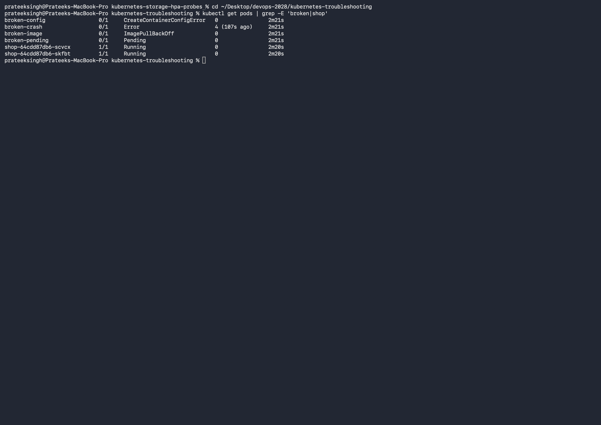
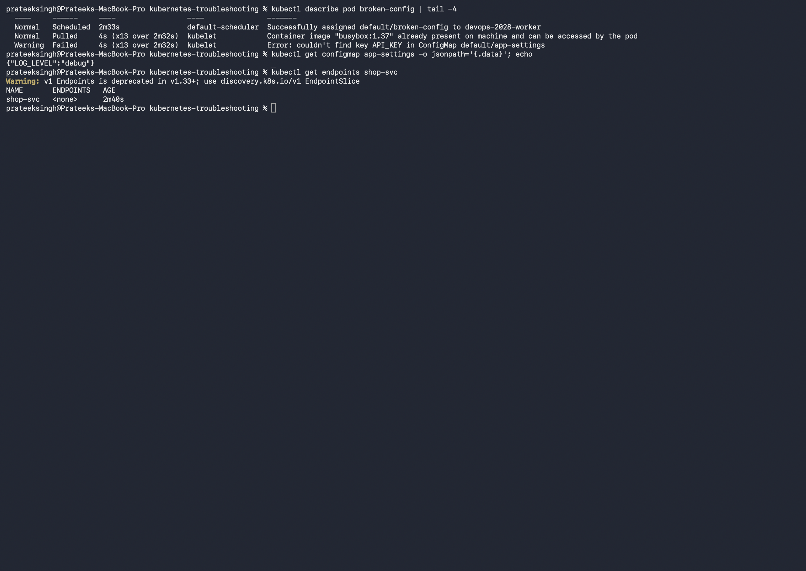
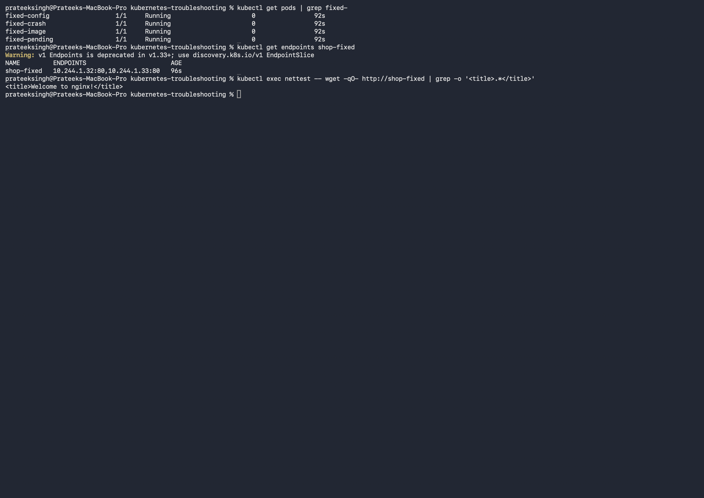

# Kubernetes Troubleshooting (Session 14)

**Name:** Prateek Singh
**Enrollment number:** 24BCS10135

## Homework tasks

**Task 1** — hands-on practice with the troubleshooting commands: `kubectl get`, `describe`,
`logs`, `exec`, `events`, `explain`, `top`, and `get -o wide`.

**Task 2** — break things on purpose and troubleshoot them: CrashLoopBackOff,
ImagePullBackOff, ErrImagePull, Pending, ContainerCreating, Service connectivity, DNS, Pod
networking and configuration issues. For each one: identify, investigate, find the root
cause, fix, verify, document.

**Task 3** — mini project.

Broken manifests are in [manifests](manifests) and the corrected ones are in
[fixed](fixed).

---

# Task 1: The commands

## kubectl get

The first command, every time. It tells me **that** something is wrong.

```text
$ kubectl get pods
NAME             READY   STATUS                       RESTARTS      AGE
broken-config    0/1     CreateContainerConfigError   0             46s
broken-crash     0/1     Error                        3 (33s ago)   46s
broken-image     0/1     ImagePullBackOff             0             46s
broken-pending   0/1     Pending                      0             46s
```

`READY 0/1` plus a status that is not `Running` is the signal. `RESTARTS` climbing means a
crash loop.

## kubectl get -o wide

Adds the IP and which node the Pod landed on.

```text
$ kubectl get pods -o wide
NAME             READY   STATUS                       RESTARTS      AGE    IP            NODE
broken-config    0/1     CreateContainerConfigError   0             2m5s   10.244.1.31   devops-2028-worker
broken-crash     0/1     Error                        4 (91s ago)   2m5s   10.244.1.29   devops-2028-worker
broken-image     0/1     ImagePullBackOff             0             2m5s   10.244.1.30   devops-2028-worker
broken-pending   0/1     Pending                      0             2m5s   <none>        <none>
```

`broken-pending` has **no IP and no node**. That immediately narrows it down: it was never
scheduled, so this is a scheduling problem, not an application problem. The other three got a
node, so their problem happened after scheduling.

## kubectl describe

Tells me **why**. The Events section at the bottom is the part that matters.

```text
$ kubectl describe pod broken-config
Events:
  Normal   Scheduled  56s               default-scheduler  Successfully assigned default/broken-config to devops-2028-worker
  Normal   Pulled     3s (x6 over 55s)  kubelet            Container image "busybox:1.37" already present on machine
  Warning  Failed     3s (x6 over 55s)  kubelet            Error: couldn't find key API_KEY in ConfigMap default/app-settings
```

## kubectl logs

For when the container **started** and then misbehaved.

```text
$ kubectl logs broken-crash
starting up
config file missing, exiting
```

The key thing: `logs` is useless for `ImagePullBackOff`, because the container never started
so there is nothing to log. `describe` is the tool there. Choosing between the two correctly
is most of the skill.

`kubectl logs pod --previous` shows the logs of the **previous** container, which is what you
need for a crash loop, since the current one may have only just started.

## kubectl exec

Gets me inside a running container to test things from where the app actually sits.

```text
$ kubectl exec nettest -- wget -qO- --timeout=5 http://shop-wrongport
wget: can't connect to remote host (10.96.106.67): Connection refused
```

I keep a small busybox Pod around just for this:

```bash
kubectl run nettest --image=busybox:1.37 --restart=Never --command -- sleep 3600
```

## kubectl events

All the recent events in one list instead of describing Pods one by one.

```text
$ kubectl events --types=Warning
2m2s   Warning  FailedScheduling  Pod/broken-pending  0/2 nodes are available: 1 Insufficient cpu, 1 Insufficient memory...
41s    Warning  BackOff           Pod/broken-crash    Back-off restarting failed container app
33s    Warning  Failed            Pod/broken-image    Failed to pull image "nginx:does-not-exist-123": ... not found
6s     Warning  Failed            Pod/broken-config   Error: couldn't find key API_KEY in ConfigMap default/app-settings
```

Filtering to `--types=Warning` gives a list of everything currently wrong in the namespace,
which is a good first look when several things are broken at once.

## kubectl explain

Looks up what a field means without opening the docs.

```text
$ kubectl explain pod.spec.containers.resources
KIND:       Pod
VERSION:    v1

FIELD: resources <ResourceRequirements>

DESCRIPTION:
    Compute Resources required by this container. Cannot be updated.
```

`kubectl explain pod.spec --recursive` prints the whole tree, which is useful when I cannot
remember the exact nesting of a field.

## kubectl top

Actual CPU and memory, which `get` does not show. Needs metrics-server installed.

```text
$ kubectl top nodes
NAME                        CPU(cores)   CPU(%)   MEMORY(bytes)   MEMORY(%)
devops-2028-control-plane   146m         0%       1122Mi          7%
devops-2028-worker          33m          0%       269Mi           1%
```

---

# Task 2: Troubleshooting real failures

I broke six things on purpose. All of them at once:

```text
$ kubectl get pods
broken-config    0/1   CreateContainerConfigError   0             46s
broken-crash     0/1   Error                        3 (33s ago)   46s
broken-image     0/1   ImagePullBackOff             0             46s
broken-pending   0/1   Pending                      0             46s
shop-...-scvcx   1/1   Running                      0             45s
shop-...-skfbt   1/1   Running                      0             45s
```



---

## Issue 1: ImagePullBackOff and ErrImagePull

**Identify**

```text
$ kubectl get pod broken-image
NAME           READY   STATUS             RESTARTS   AGE
broken-image   0/1     ImagePullBackOff   0          46s
```

**Investigate**

```text
$ kubectl describe pod broken-image
Events:
  Normal   Pulling  4s (x3 over 45s)   kubelet  Pulling image "nginx:does-not-exist-123"
  Warning  Failed   3s (x3 over 43s)   kubelet  Failed to pull image "nginx:does-not-exist-123": ... not found
  Warning  Failed   3s (x3 over 43s)   kubelet  Error: ErrImagePull
  Warning  Failed   16s (x2 over 43s)  kubelet  Error: ImagePullBackOff
```

**Root cause** — the tag `does-not-exist-123` is not on Docker Hub.

Both statuses show up here and they are the same problem at different stages.
**`ErrImagePull`** is the first failure. **`ImagePullBackOff`** is what it becomes once
Kubernetes starts waiting longer between retries instead of hammering the registry.

Other things that cause this: a typo in the image name, a private registry with no
`imagePullSecret`, or the wrong architecture.

**Fix** — [fixed/fix-01-image.yaml](fixed/fix-01-image.yaml) uses `nginx:alpine`.

**Verify**

```text
$ kubectl get pod fixed-image
fixed-image   1/1   Running   0   36s
```

---

## Issue 2: CrashLoopBackOff

**Identify**

```text
$ kubectl get pod broken-crash
NAME           READY   STATUS   RESTARTS      AGE
broken-crash   0/1     Error    3 (33s ago)   46s
```

The restart count going up is the giveaway. The status alternates between `Error` and
`CrashLoopBackOff` as Kubernetes keeps retrying with longer gaps.

**Investigate** — here the container *did* start, so `logs` is the right tool:

```text
$ kubectl logs broken-crash
starting up
config file missing, exiting
```

**Root cause** — the container runs a command that exits immediately. Kubernetes expects the
main process to keep running, so when it exits it restarts it, and the cycle repeats.

In real apps this is usually a missing config file, a failed database connection on startup,
or a wrong command in the manifest.

**Fix** — [fixed/fix-02-crash.yaml](fixed/fix-02-crash.yaml) keeps the process alive.

**Verify**

```text
$ kubectl get pod fixed-crash
fixed-crash   1/1   Running   0   36s
```

Zero restarts this time.

---

## Issue 3: Pending

**Identify**

```text
$ kubectl get pod broken-pending -o wide
NAME             READY   STATUS    RESTARTS   AGE    IP       NODE
broken-pending   0/1     Pending   0          2m5s   <none>   <none>
```

No IP and no node, so it was never scheduled.

**Investigate**

```text
$ kubectl describe pod broken-pending
Events:
  Warning  FailedScheduling  43s (x2 over 46s)  default-scheduler  0/2 nodes are available: 1 Insufficient cpu, 1 Insufficient memory, 1 node(s) had untolerated taint(s).
```

**Root cause** — the Pod asks for 50 CPUs and 100Gi of memory. No node has that. The message
even breaks it down: one node fails on resources and the other is the control plane, which
has a taint keeping normal Pods off it.

**Fix** — [fixed/fix-03-pending.yaml](fixed/fix-03-pending.yaml) asks for `100m` CPU and
`64Mi` memory.

**Verify**

```text
$ kubectl get pod fixed-pending
fixed-pending   1/1   Running   0   36s
```

---

## Issue 4: ContainerCreating and configuration errors

`ContainerCreating` on its own is normal for a few seconds while the image is pulled and
volumes are attached. It is only a problem when it does not move on, and then it usually
means a volume will not mount or a secret or ConfigMap is missing.

The related permanent version of that is `CreateContainerConfigError`:

**Identify**

```text
$ kubectl get pod broken-config
NAME            READY   STATUS                       RESTARTS   AGE
broken-config   0/1     CreateContainerConfigError   0          56s
```

**Investigate**

```text
$ kubectl describe pod broken-config
Events:
  Warning  Failed  3s (x6 over 55s)  kubelet  Error: couldn't find key API_KEY in ConfigMap default/app-settings

$ kubectl get configmap app-settings -o jsonpath='{.data}'
{"LOG_LEVEL":"debug"}
```

**Root cause** — the Pod asks for the key `API_KEY`, and the ConfigMap only has `LOG_LEVEL`.
The error message names the exact key and the exact ConfigMap, which made this the fastest
one to find.

**Fix** — [fixed/fix-04-config.yaml](fixed/fix-04-config.yaml) adds the key.

**Verify**

```text
$ kubectl logs fixed-config
API_KEY is demo-key-12345
```



---

## Issue 5: Service connectivity, selector does not match

**Identify** — the Service looks completely healthy:

```text
$ kubectl get svc shop-svc
NAME       TYPE        CLUSTER-IP      EXTERNAL-IP   PORT(S)   AGE
shop-svc   ClusterIP   10.96.179.126   <none>        80/TCP    56s
```

There is no error anywhere, but nothing can reach it.

**Investigate**

```text
$ kubectl get endpoints shop-svc
NAME       ENDPOINTS   AGE
shop-svc   <none>      55s
```

Empty endpoints. Then compare the two sides:

```text
$ kubectl get svc shop-svc -o jsonpath='{.spec.selector}'
{"app":"shop-frontend"}

$ kubectl get pods -l app=shop -o jsonpath='{.items[0].metadata.labels}'
{"app":"shop","pod-template-hash":"64cdd87db6"}
```

**Root cause** — the Service selects `app=shop-frontend` and the Pods are labelled
`app=shop`. They never match, so the Service has nothing to send traffic to.

**Fix** — [fixed/fix-05-06-service.yaml](fixed/fix-05-06-service.yaml) selects `app=shop`.

**Verify**

```text
$ kubectl get endpoints shop-fixed
NAME         ENDPOINTS                       AGE
shop-fixed   10.244.1.32:80,10.244.1.33:80   36s

$ kubectl exec nettest -- wget -qO- http://shop-fixed | grep -o '<title>.*</title>'
<title>Welcome to nginx!</title>
```

---

## Issue 6: Service connectivity, wrong target port

This one is sneakier, because the endpoints are **not** empty.

**Identify**

```text
$ kubectl exec nettest -- wget -qO- --timeout=5 http://shop-wrongport
wget: can't connect to remote host (10.96.106.67): Connection refused
```

**Investigate**

```text
$ kubectl get endpoints shop-wrongport
NAME             ENDPOINTS                           AGE
shop-wrongport   10.244.1.32:8080,10.244.1.33:8080   55s
```

The endpoints exist and the Pod IPs are right, but the **port is 8080**. nginx listens on 80.

Checking DNS to rule it out:

```text
$ kubectl exec nettest -- nslookup shop-wrongport.default.svc.cluster.local
Name:	shop-wrongport.default.svc.cluster.local
Address: 10.96.106.67
```

**Root cause** — `targetPort: 8080` but the container listens on 80. The selector is fine, so
the Service finds the Pods and then forwards to a port nothing is listening on.

This is also how I tell the three failure types apart:

| Symptom | What it means |
|---|---|
| Name does not resolve | DNS or the Service does not exist |
| Resolves, endpoints empty | Selector does not match the Pod labels |
| Resolves, endpoints present, connection refused | Wrong `targetPort`, or the app is not listening |

**Fix and verify** — same file as issue 5, with `targetPort: 80`, verified above.

---

## DNS and Pod networking

I did not need to fix a real DNS fault, because in every case above DNS resolved correctly
and the problem was elsewhere. That is itself the useful lesson: **check DNS to rule it out**
rather than assuming it.

The checks I use:

```bash
# does the name resolve at all
kubectl exec nettest -- nslookup my-service.default.svc.cluster.local

# is the cluster DNS server reachable
kubectl exec nettest -- cat /etc/resolv.conf     # should show nameserver 10.96.0.10

# is CoreDNS healthy
kubectl get pods -n kube-system -l k8s-app=kube-dns
kubectl logs -n kube-system -l k8s-app=kube-dns --tail=20

# pod to pod, bypassing Services entirely
kubectl exec nettest -- ping -c 2 <pod-ip>
```

If a Pod IP pings but the Service name does not work, it is a Service or DNS problem. If the
Pod IP does not even ping, it is the network layer, usually the CNI plugin.



---

# Task 3: Mini project

The mini project is the whole exercise above: a namespace with six deliberate faults covering
image, crash, scheduling, configuration and two different Service problems, each one
diagnosed from the symptom down to the root cause and then fixed and verified.

To run it end to end:

```bash
# break everything
kubectl apply -f manifests/

# look at the damage
kubectl get pods -o wide
kubectl events --types=Warning

# fix everything
kubectl apply -f fixed/

# confirm
kubectl get pods | grep fixed-
kubectl get endpoints shop-fixed
```

---

## The order I work in now

1. `kubectl get pods -o wide` — what is broken, and did it even get a node
2. `kubectl describe pod <name>` — read the Events at the bottom
3. `kubectl logs <name>` — only if the container actually started
4. `kubectl logs <name> --previous` — for a crash loop
5. `kubectl get endpoints <svc>` — for anything Service related
6. `kubectl exec` into a test Pod — to check from where the app really sits

## Status cheat sheet

| Status | Usual cause | First command |
|---|---|---|
| `Pending` | No node has room, or a taint | `describe pod` |
| `ContainerCreating` (stuck) | Volume or Secret/ConfigMap missing | `describe pod` |
| `ErrImagePull` / `ImagePullBackOff` | Bad image name, tag, or registry auth | `describe pod` |
| `CrashLoopBackOff` | App exits or crashes on start | `logs --previous` |
| `CreateContainerConfigError` | Missing ConfigMap or Secret key | `describe pod` |
| `Running` but no traffic | Service selector or targetPort | `get endpoints` |
| `OOMKilled` | Memory limit too low | `describe pod`, raise the limit |

## What I took away

- `get` says what is wrong, `describe` says why, and `logs` only helps once the container has
  actually started. Picking the wrong one wastes the most time.
- A Pod with no IP and no node in `-o wide` was never scheduled, which rules out half the
  possible causes instantly.
- A Service can look perfectly healthy and still be broken. `kubectl get endpoints` is the
  check, and empty endpoints and wrong-port endpoints are two different faults with two
  different fixes.
- `kubectl events --types=Warning` is the fastest way to see everything wrong at once.
