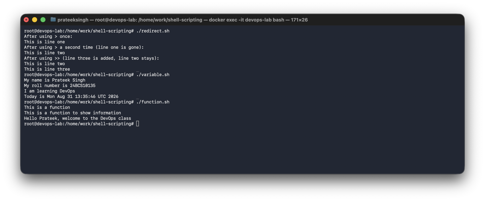
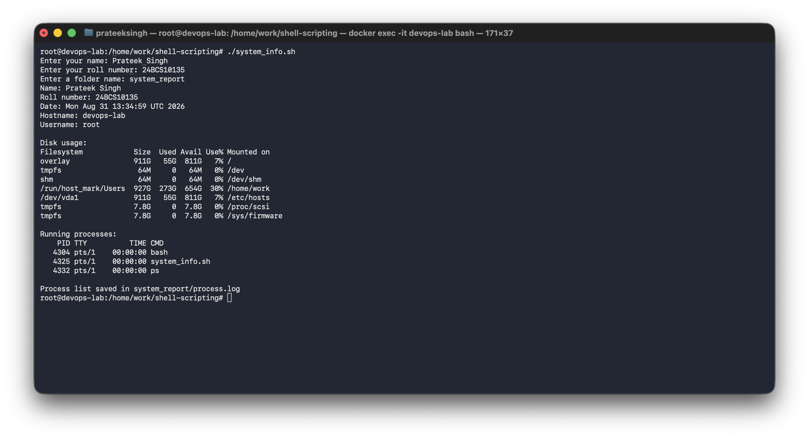
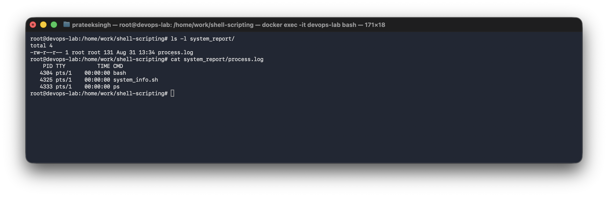

# Shell Scripting (Session 3)

**Name:** Prateek Singh
**Enrollment number:** 24BCS10135

## Homework

Write a shell script that prints the date, hostname, username, disk usage and running
processes. It should use variables, take input with `read`, create a directory and save the
process info in a file inside that directory, using `mkdir`, `touch`, `echo`, `df`, `ps`,
`>` and `read -p`.

That script is [`system_info.sh`](system_info.sh). The other scripts are the class practice.

## How to run

```bash
chmod +x *.sh
./system_info.sh
```

---

## 1. hello.sh

Makes a folder and a file, writes into it and prints it.

```bash
mkdir -p hello
touch hello/app.log
echo "This is my logfile" > hello/app.log
cat hello/app.log
```

Output:

```
This is my logfile
```

## 2. redirect.sh

`>` overwrites the file. `>>` adds to the end.

```bash
mkdir -p redirect
echo "This is line one" > redirect/app.log
echo "After using > once:"
cat redirect/app.log

echo "This is line two" > redirect/app.log
echo "After using > a second time (line one is gone):"
cat redirect/app.log

echo "This is line three" >> redirect/app.log
echo "After using >> (line three is added, line two stays):"
cat redirect/app.log
```

Output:

```
After using > once:
This is line one
After using > a second time (line one is gone):
This is line two
After using >> (line three is added, line two stays):
This is line two
This is line three
```

Line one is gone because the second `>` replaced the whole file.

## 3. variable.sh

A variable stores a value so I can use it again. No spaces around the `=` sign.

```bash
name="Prateek Singh"
roll_no="24BCS10135"
course="DevOps"

echo "My name is $name"
echo "My roll number is $roll_no"
echo "I am learning $course"

today=$(date)
echo "Today is $today"
```

Output:

```
My name is Prateek Singh
My roll number is 24BCS10135
I am learning DevOps
Today is Mon Aug 31 13:35:46 UTC 2026
```

`$(date)` runs the command and puts its output in the variable.

## 4. input.sh

`read -p` prints the question and waits for me to type.

```bash
read -p "Enter your name: " name
read -p "Enter your roll number: " roll_no
read -p "Enter your comment: " comment

echo "My name is $name"
echo "My roll number is $roll_no"
echo "My comment is: $comment"
```

Output:

```
Enter your name: Prateek Singh
Enter your roll number: 24BCS10135
Enter your comment: Shell scripting is fun
My name is Prateek Singh
My roll number is 24BCS10135
My comment is: Shell scripting is fun
```

## 5. condition.sh

`if` checks a condition, `elif` checks the next one, `else` runs if nothing matched.
`-lt` means less than.

```bash
read -p "Enter your age: " age

if [ $age -lt 0 ]; then
    echo "Invalid age. Please enter a valid age."
elif [ $age -lt 13 ]; then
    echo "You are a child."
elif [ $age -lt 20 ]; then
    echo "You are a teenager."
else
    echo "You are an adult."
fi
```

I typed 20:

```
Enter your age: 20
You are an adult.
```

## 6. loop.sh

A for loop runs once for every value in the list.

```bash
for i in {1..5}
do
  echo "This is iteration number $i"
done
```

Output:

```
This is iteration number 1
This is iteration number 2
This is iteration number 3
This is iteration number 4
This is iteration number 5
```

## 7. while_loop.sh

A while loop runs while the condition is true. `((count++))` adds 1 each time, otherwise it
would never stop.

```bash
count=0
while [ $count -lt 5 ]
do
  echo "This is iteration number $count"
  ((count++))
done
```

Output:

```
This is iteration number 0
This is iteration number 1
This is iteration number 2
This is iteration number 3
This is iteration number 4
```

## 8. menu_loop.sh

`while true` never stops on its own so I need `break`. `continue` skips to the next round.

```bash
while true; do
    read -p "Enter a number (or 'q' to quit): " input

    if [[ $input == "q" ]]; then
        echo "Exiting the loop."
        break
    elif ! [[ $input =~ ^[0-9]+$ ]]; then
        echo "Invalid input. Please enter a valid number."
        continue
    fi

    echo "You entered: $input"
done
```

I typed 7, then abc, then 42, then q:

```
You entered: 7
Invalid input. Please enter a valid number.
You entered: 42
Exiting the loop.
```

## 9. function.sh

A function is a group of commands with a name. It only runs when I call the name.

```bash
show_info() {
  echo "This is a function"
  echo "This is a function to show information"
}

# a function can also take arguments, $1 is the first one
greet() {
  echo "Hello $1, welcome to the DevOps class"
}

show_info
greet "Prateek"
```

Output:

```
This is a function
This is a function to show information
Hello Prateek, welcome to the DevOps class
```

Screenshot of `redirect.sh`, `variable.sh` and `function.sh` running:



## 10. system_info.sh (the homework)

Commands used: `read -p` for input, `date`, `hostname`, `whoami`, `df -h` for disk usage,
`ps` for processes, `mkdir` and `touch` to make the folder and file, and `>` to send the `ps`
output into the file.

```bash
#!/bin/bash

read -p "Enter your name: " name
read -p "Enter your roll number: " roll_no
read -p "Enter a folder name: " folder_name

current_date=$(date)
host_name=$(hostname)
user_name=$(whoami)

mkdir $folder_name
touch $folder_name/process.log

echo "Name: $name"
echo "Roll number: $roll_no"
echo "Date: $current_date"
echo "Hostname: $host_name"
echo "Username: $user_name"

echo ""
echo "Disk usage:"
df -h

echo ""
echo "Running processes:"
ps

ps > $folder_name/process.log
echo ""
echo "Process list saved in $folder_name/process.log"
```

Output:

```
Enter your name: Prateek Singh
Enter your roll number: 24BCS10135
Enter a folder name: system_report
Name: Prateek Singh
Roll number: 24BCS10135
Date: Mon Aug 31 13:34:59 UTC 2026
Hostname: devops-lab
Username: root

Disk usage:
Filesystem            Size  Used Avail Use% Mounted on
overlay               911G   55G  811G   7% /
tmpfs                  64M     0   64M   0% /dev
shm                    64M     0   64M   0% /dev/shm
/run/host_mark/Users  927G  273G  654G  30% /home/work
/dev/vda1             911G   55G  811G   7% /etc/hosts
tmpfs                 7.8G     0  7.8G   0% /proc/scsi
tmpfs                 7.8G     0  7.8G   0% /sys/firmware

Running processes:
    PID TTY          TIME CMD
   4304 pts/1    00:00:00 bash
   4325 pts/1    00:00:00 system_info.sh
   4332 pts/1    00:00:00 ps

Process list saved in system_report/process.log
```

Screenshot of the run:



Checking the folder and the file were really created:

```
$ ls -l system_report/
total 4
-rw-r--r-- 1 root root 131 Aug 31 13:34 process.log

$ cat system_report/process.log
    PID TTY          TIME CMD
   4304 pts/1    00:00:00 bash
   4325 pts/1    00:00:00 system_info.sh
   4333 pts/1    00:00:00 ps
```



The PID of `ps` is 4333 in the file but 4332 on the screen, because the script runs `ps`
twice, once for the screen and once for the file, and each run is a new process.

## Mistakes I made

- Got "Permission denied" when running the script. Fixed with `chmod +x`.
- Wrote `name = "Prateek"` with spaces and got "command not found". There must be no spaces
  around the `=`.
- Called the function as `show_info()` with brackets and nothing printed. In bash you call it
  as `show_info` with no brackets.
